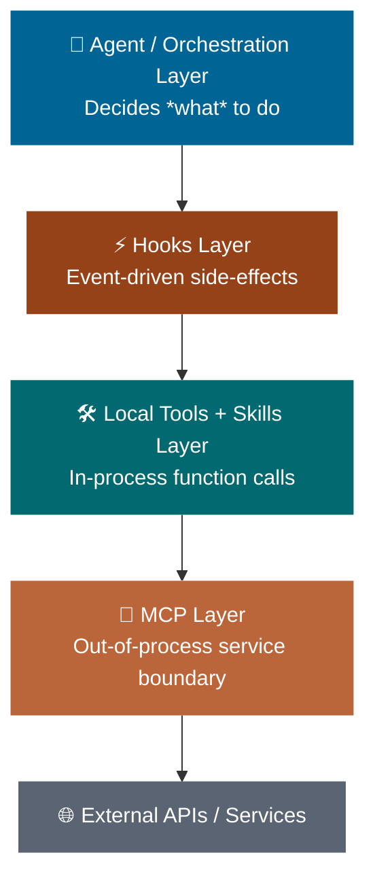
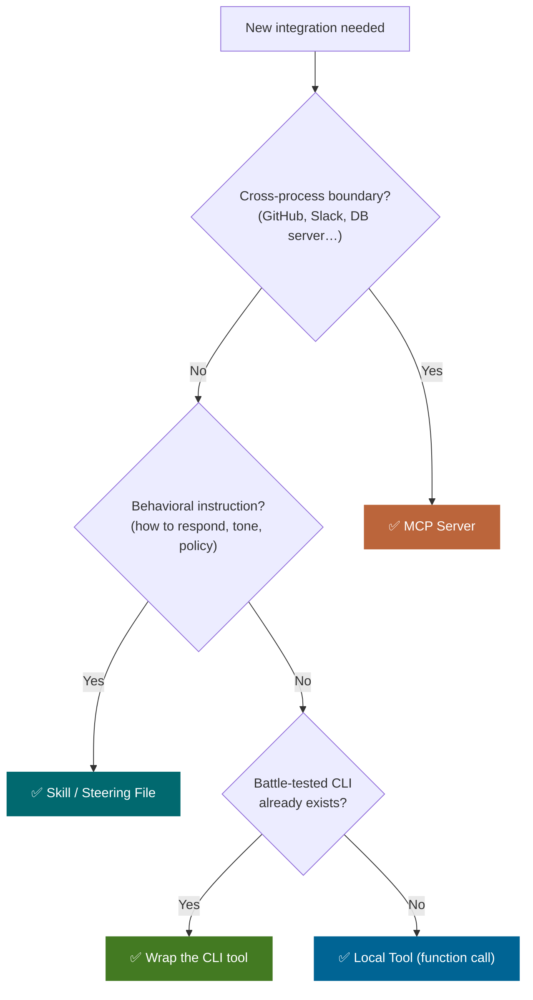

# The Confusion Problem

*Vol 1 · A Field Guide to AI Agent Integration Patterns*

---

## The Confusion Problem

Ask five AI engineers "when should I use MCP?" and you'll get five different answers. The root cause isn't a lack of documentation — it's that MCP, local tools, skills, CLI tools, steering files, and hooks all solve an overlapping problem (giving AI models access to capabilities and data) while sitting at completely different layers of the stack, designed for different audiences and scenarios.

The confusion is compounded by vocabulary collisions. The word "tool" means at least three different things depending on context:

- In **function-calling** contexts, a "tool" is an in-process JSON schema the LLM can invoke
- In **MCP**, a "Tool" is one of three server primitives (alongside Resources and Prompts)
- In **agentic frameworks** like Claude Code or Cursor, a "skill" sometimes refers to reusable workflows, sometimes to Markdown files with behavioral instructions

These overlapping vocabularies make it hard to reason clearly about architecture. This series uses precise definitions throughout and avoids conflating these concepts. (See the [vocabulary note in the index](../index.md#a-note-on-vocabulary) for the full conventions.)

>**⚠️** **Why This Matters:** Picking the wrong pattern costs real money and time. Choosing MCP when function calling would suffice adds network overhead, context bloat, and operational complexity. Choosing function calling when MCP is warranted means re-implementing the same connector for every new model or agent you add. Picking skills when you need deterministic execution means relying on LLM interpretation where you wanted a precise API call.

---

## Conceptual Foundation: The Agent Architecture Stack

The clearest way to cut through the confusion is to think of AI agent systems as a layered stack. Each layer answers a different question.

  <iframe src="../agent_architecture_diagram.html"
          title="Agent Architecture — interactive diagram"
          loading="lazy"></iframe>
  <figcaption>Figure 1 — Click any layer to learn when and why to use it. &nbsp;<a href="../agent_architecture_diagram.html" target="_blank">Open full screen ↗</a></figcaption>

| Layer                        | What It Does                                                                                                                                 | Primary Concern                        |
| ---------------------------- | -------------------------------------------------------------------------------------------------------------------------------------------- | -------------------------------------- |
| **Agent / Orchestration**    | The LLM + reasoning loop that decides what to do next                                                                                        | Intelligence & planning                |
| **Skills**                   | Reusable behavioral playbooks injected into the context window                                                                               | Know-how & guidance                    |
| **Local Tools**              | In-process functions + CLI wrappers the LLM can call; execution happens locally in the same runtime or as a subprocess                       | Fast, deterministic actions            |
| **MCP Servers**              | Standardized protocol for connecting to external systems; tools, resources, and prompts exposed via JSON-RPC                                 | Portability & abstraction              |
| **External APIs / Services** | Third-party systems that MCP servers front                                                                                                   | Data & effects                         |
| **Hooks**                    | User-defined commands or handlers that execute automatically at lifecycle events (pre/post tool call, session start/end, permission prompts) | Deterministic enforcement & automation |

These layers are not mutually exclusive. Production systems often use all of them simultaneously: an agent orchestrates a task, uses a steering file for session-wide behavioral contracts, loads a skill for behavioral guidance, calls a local tool or CLI for in-process work, uses hooks for safety enforcement, and connects to an MCP server for live external data.

**The key insight:** each layer answers a different question. Understanding which question you are trying to answer eliminates most of the confusion.

---

## The Decision Framework

> **Start here before reading the pattern deep-dives.** Work through the questions in order — the first YES wins.

| Question                                                                                                                                                                                     | If YES →                                                | If NO →                                                   |
| -------------------------------------------------------------------------------------------------------------------------------------------------------------------------------------------- | ------------------------------------------------------- | --------------------------------------------------------- |
| Is this a universal rule, constraint, or session-wide convention that must apply to **every** interaction (regardless of query type)?                                                        | Use **Steering File** (CLAUDE.md / AGENTS.md)           | Move to next question                                     |
| Is this a cross-cutting concern that must execute deterministically on every matching event, regardless of LLM judgment (safety guardrail, audit logging, auto-formatting, file protection)? | Use a **Hook** (settings.json PreToolUse / PostToolUse) | Move to next question                                     |
| Does the capability require connecting to an external service (database, SaaS API, remote file system)?                                                                                      | Consider **MCP** or direct API call                     | Move to next question                                     |
| Does the capability need to be reused across multiple AI clients, models, or agents?                                                                                                         | Use **MCP** (standardization pays off)                  | Move to next question                                     |
| Is enterprise-grade credential isolation, multi-tenant access control, or audit logging required?                                                                                            | Use **MCP** (remote Streamable HTTP)                    | Move to next question                                     |
| Is the data live / dynamic (changes between invocations and LLM needs current state)?                                                                                                        | Use **MCP** or direct API call                          | Move to next question                                     |
| Does a well-maintained CLI tool already exist for this operation?                                                                                                                            | Use **CLI** (simplest path)                             | Move to next question                                     |
| Is the capability a reusable behavioral pattern or domain-specific workflow with stable knowledge?                                                                                           | Use a **Skill** (SKILL.md)                              | Move to next question                                     |
| Is the operation simple, in-process, and part of a single-agent application with few tools (<20)?                                                                                            | Use **Local Tool** / Function Calling                   | Re-evaluate complexity; may need MCP or abstraction layer |

---

### ℹ️  The Local Package Default

> For local AI packages specifically — tools that run on a developer's machine, read files or environment state, and call an LLM to do something with that data — the correct default is: **start with Local Tools (function calling) for most operations, add Skills for behavioral customization, and reach for MCP only when you need multi-client portability or external connector abstraction.**

---

## The Local AI Package Context

The question that motivated this series is specifically about **local AI packages**: software that a developer runs on their own machine, which reads information from local or remote sources and uses an AI model to process, transform, or act on that information. Examples include local code analysis tools, document processors, personal knowledge assistants, and developer productivity scripts.

For such packages, the most consequential default decision is whether to reach for MCP or local tools as the primary integration mechanism. MCP was designed for the enterprise connectivity problem — many different AI clients needing to connect to many different data sources. Most local packages don't have this problem. They have one client, a small and well-defined set of data sources, and no multi-tenant access control requirements. For those packages, local tools are almost always the right starting point.

The next five chapters cover each pattern in depth, collectively referred to throughout this series as **"The Five Integration Patterns"**. Read them in any order; the decision framework above tells you which one to read first for your current problem.

---

*→ Next: [Chapter 2 — Model Context Protocol](02-mcp.md)*
*→ Or jump to: [Chapter 7 — Head-to-Head Comparison](07-comparison-and-economics.md)*
