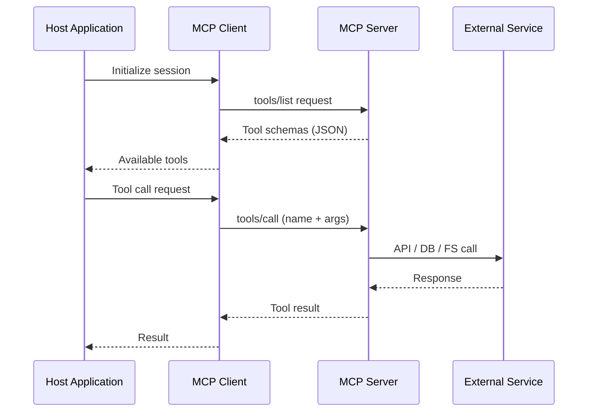

# Model Context Protocol (MCP)

*Vol 1 · A Field Guide to AI Agent Integration Patterns*

---

## What MCP Is

MCP is an open protocol, initially introduced by Anthropic in late 2024, that standardizes how AI applications connect to external data sources and tools. At its core, it is a connectivity standard — often called the "USB-C for AI integrations," meaning it standardizes the *connection mechanism* rather than what flows through it. The analogy is useful but has limits worth naming: USB-C guarantees physical compatibility; MCP guarantees message format. Two MCP servers can both expose a `get_customer` tool with completely different schemas, semantics, and consistency guarantees — semantic interoperability is still your responsibility. Authentication practices also remain uneven across the ecosystem, with the OAuth 2.1 framework added in 2025 still seeing incomplete adoption in production servers. [Vol1-Ref-A](../references.md#vol1-ref-a) In 2025, Anthropic donated the protocol to the Linux Foundation, with OpenAI, Google, and Microsoft joining as co-sponsors. All three now ship native MCP support in their flagship SDKs. MCP is industry infrastructure, not a vendor-specific solution. [Vol1-Ref-G](../references.md#vol1-ref-g)

The central problem MCP solves is the **N×M integration problem**. Before MCP, if you had N AI applications and M external data sources, you needed N×M custom integrations — each application built its own bespoke connection to each data source. MCP collapses this to N+M: each data source builds one MCP server, each AI application builds one MCP client, and they interoperate through the standard protocol.

---

## Architecture

MCP uses a three-component architecture:

| Component | Role | Example |
|-----------|------|---------|
| **MCP Host** | The AI application that manages connections to MCP servers | Claude Desktop, Cursor, VS Code |
| **MCP Client** | A component inside the host that maintains a session with one MCP server | One client instance per server |
| **MCP Server** | A program that exposes capabilities to AI applications via the protocol | GitHub MCP Server, Filesystem Server, Sentry MCP |

The host creates one MCP Client for each MCP Server it connects to. Each client maintains a dedicated, stateful session with its server. All communication travels via JSON-RPC 2.0.

---

## The Three Server Primitives

MCP servers can expose three types of capabilities. This is an important distinction from function calling — MCP is **not** just "remote function calling."

| Primitive | What It Is | Use Case Example |
|-----------|-----------|------------------|
| **Tools** | Executable functions the AI can invoke (with typed schemas) | `query_database()`, `create_issue()`, `search_files()` |
| **Resources** | Data sources providing contextual information (file-like interface) | Database schema, file contents, API response cache |
| **Prompts** | Reusable parametrized templates for structuring LLM interactions | System prompt templates, few-shot examples for a domain |

The Resources and Prompts primitives have no analog in standard function calling. Resources allow an MCP server to provide structured context — like a live database schema or a continuously updated document — without the AI needing to "call" anything. Prompts allow servers to inject domain-specific interaction templates into the agent's context at session start.

---

## Transport Layer

MCP supports two transport mechanisms:

| Transport | How It Works | When to Use |
|-----------|-------------|-------------|
| **STDIO** | Standard input/output streams; server runs as a local subprocess | Local development, single-machine setups, best performance |
| **Streamable HTTP** | HTTP POST for requests + optional Server-Sent Events for streaming; supports OAuth | Remote servers, multi-tenant, enterprise deployments |

---

## Dynamic Tool Discovery

One of MCP's key advantages over function calling is **dynamic tool discovery**. Rather than hard-coding tool schemas into your application, the client calls `tools/list` at runtime to fetch the current set of available tools. When the server's tools change, it sends a `tools/list_changed` notification and the client refreshes — no code deployment required.

This is particularly valuable for external services with evolving APIs. A GitHub MCP server can add new tools for new API capabilities without the host application making any code changes.

---

## The Context Cost of MCP

MCP's flexibility comes with a concrete cost: every tool schema from every connected server is loaded into the context window when the client connects. In practice, this can be substantial.

Measured production numbers:

- A typical multi-server setup (GitHub, Slack, Sentry, Grafana, Splunk) can consume ~55,000 tokens in tool definitions before any conversation starts. [Vol1-Ref-A](../references.md#vol1-ref-a)
- Apideck measured 3 MCP servers (GitHub, Slack, Sentry) consuming 143,000 of a 200,000-token context window — **72% of the available context** — before any conversation began. [Vol1-Ref-C](../references.md#vol1-ref-c)
- Cloudflare's Code Mode demonstrated a 244× token reduction (1,000 tokens vs. 244,000) by having models write code against pre-authorized API clients rather than exposing individual endpoints as MCP tools. Exposing the full Cloudflare API as MCP tools would require 1.17 million tokens. [Vol1-Ref-E](../references.md#vol1-ref-e)

This overhead has real production consequences — see the quantified breakdown alongside the Apideck measurement in [Chapter 7](07-comparison-and-economics.md#context-window-economics). [Vol1-Ref-D](../references.md#vol1-ref-d)

The practical implication: **a large MCP server is a context bomb.** An MCP server with 40 tools is loading all 40 schemas on every connection, consuming thousands of tokens before any user message is processed. Design MCP servers to be narrow and focused: one server per domain, with clearly distinct and non-overlapping tools. If a server is growing beyond 10–15 tools, consider splitting it.

---

## Strengths

- **Universal interoperability** — one MCP server works with any MCP-compatible client (Claude, Cursor, VS Code, and more)
- **Dynamic tool discovery** — new tools appear without client code changes
- **Credential isolation** — API keys and secrets live on the server, not in the agent runtime
- **Supports Resources and Prompts** — not just tools; can provide structured context and interaction templates
- **Real-time notifications** — server can push `tools/list_changed` when tools change
- **Official server ecosystem** — GitHub, Slack, Sentry, Notion, and others maintain official MCP servers with vendor-level support

---

## Weaknesses

- **Setup complexity** — requires building and running a server process
- **Context overhead** — even before the first user message, MCP schemas consume tokens
- **Network latency** on each tool call (unless using local STDIO transport)
- **Operational overhead** — the server must be deployed, monitored, and updated
- **Wrong tool for single-agent, in-process scenarios** — the abstraction adds cost with no benefit when you have one client and control both the agent and the "service"

---

## When MCP Earns Its Place

MCP is the right choice when:

1. **Official servers exist** for the services you need — GitHub, Jira, Slack, Notion, Sentry. These are maintained by vendors and handle OAuth, rate limiting, and API evolution. You get them for free.
2. **Multi-client portability is a real requirement** — the same capability needs to work across multiple AI agents or applications you don't control.
3. **Credential isolation is a hard requirement** — API keys must not live in the agent runtime (enterprise or multi-tenant scenarios).
4. **External data changes dynamically** — the external service's API evolves and you need dynamic tool discovery rather than re-deploying client code.

MCP is **not** the right choice for:
- Operations that run entirely on the local machine
- Single-agent, single-application scenarios
- Simple in-process function calls
- Cases where you would need to build the MCP server yourself for an operation a two-line function handles

---

## Dos and Don'ts

**Do use official MCP servers when they exist.** If you need to connect to GitHub, Jira, Slack, Notion, Sentry, or any major SaaS platform, check whether an official MCP server exists before writing a connector. Official servers are maintained by the vendor, handle auth token refresh, respect rate limits, and stay in sync with the upstream API. You get all of that for free.

**Don't load all tools in every request.** Sending 30+ tool schemas in every LLM request is the silent performance killer of many agentic systems. The cost is paid in tokens, latency, and model accuracy. If your agent has more tools than it realistically needs for any single interaction, implement a tool selector.

**Don't build MCP servers for local, in-process operations.** This is the most common over-engineering mistake in local AI packages. Symptoms: an MCP server that wraps `os.listdir()`, a server that runs a local Python transformation function, or a server that reads a local config file. All of these add JSON-RPC serialization overhead, process management complexity, and context token cost for operations that a two-line local tool function handles in microseconds with zero overhead.

> **A useful test:** would a regular developer implement this as a REST API service? If no, it probably shouldn't be an MCP server. MCP is a service boundary. Draw it where service boundaries make architectural sense.

**Don't give one MCP server dozens of tools to "cover all cases."** An MCP server with 40 tools is a context bomb. Every one of those tool schemas is loaded when the agent connects, consuming thousands of tokens before any user message is processed. Design MCP servers to be narrow and focused: one server per domain, with tools that are clearly distinct and non-overlapping. If a server is growing beyond 10–15 tools, consider splitting it.

---

*→ Next: [Chapter 3 — Local Tools & CLI](03-local-tools-and-cli.md)*
*← Previous: [Chapter 1 — Foundations](01-foundations.md)*
