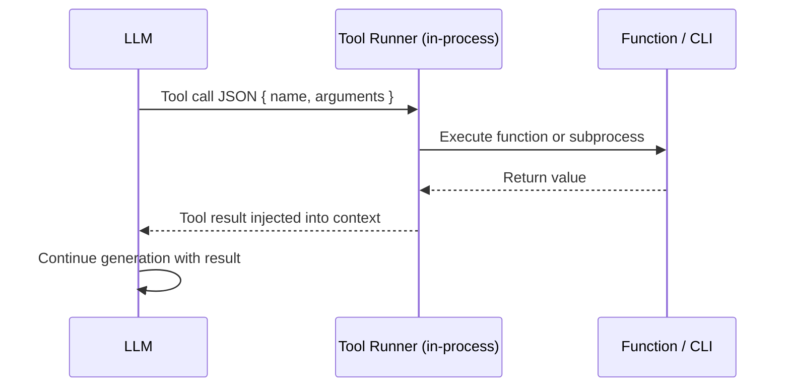

# Local Tools (Function Calling + CLI)

*Vol 1 · A Field Guide to AI Agent Integration Patterns*

---

## What Local Tools Are

Function calling — also called tool use — is the foundational mechanism by which LLMs interact with code. When you define a local tool, you provide the LLM with a JSON schema describing a function: its name, description, and parameter types. The LLM decides when to call it and with what arguments; your application executes the function and returns the result.

Everything runs in-process: no network calls, no additional servers, no protocol overhead. Tool definitions are hard-coded into your application. The LLM reads those schemas, reasons about which tools to call, and returns a structured tool-call response. Your code executes the function, gets the result, appends it to the conversation, and sends the next request.

---

## CLI Tools: A Sub-Pattern, Not a Separate Tier

Calling a CLI program — `git`, `jq`, `ripgrep`, `ffmpeg`, `sqlite3`, `curl` — is a variant of local tools, not a separate integration tier. From the LLM's perspective, a `run_git_log` tool and a `query_database` tool look identical: both are function calls with a JSON schema. The difference is purely in implementation — one runs a Python function in-process, the other spawns a subprocess. The agent never knows or cares which it is.

> **Practical Rule:** Before writing a new in-process tool, check whether a battle-tested CLI already exists for the job. If one does, wrap it. You get years of edge-case handling for free — millions of users have stress-tested `git`, `jq`, and `ripgrep` in ways your custom implementation never will.

This heuristic deserves to be treated as a constraint, not a suggestion. New in-process code means new edge cases. CLI wrappers give you the full production hardening of the underlying tool, plus the simplicity of a local function call at the LLM interface.

---

## The Context Tax

The critical trade-off of function calling is what practitioners call the **context tax**: every tool schema is included in every request, whether the model ends up using that tool or not. At small scale this is negligible. At larger scale it compounds quickly.

Measured guidance from major LLM providers illustrates the range:

| Tool Count | Approximate Token Cost | Model Accuracy Impact |
|-----------|----------------------|----------------------|
| 1–5 tools | 200–800 tokens | Negligible |
| 10–20 tools | 2,000–5,000 tokens | Minor |
| 20–50 tools | 5,000–15,000 tokens | Moderate degradation |
| 50+ tools | 15,000–50,000+ tokens | Often prohibitive |

*Token estimates based on Anthropic claude-3-5-sonnet tokenizer; schema complexity varies. See [Vol1-Ref-A](../references.md#vol1-ref-a) for provider benchmarks.*

This guidance is consistent across providers:

- **Anthropic** recommends a tool search/discovery mechanism once you exceed 30–50 tools, noting that model accuracy degrades significantly beyond that threshold. [Vol1-Ref-A](../references.md#vol1-ref-a)
- **Google** (Gemini API) advises keeping the active set to a maximum of 10–20 tools and using dynamic tool selection when the total number is large. [Vol1-Ref-F](../references.md#vol1-ref-f)
- **OpenAI** ships built-in tool filtering in the Agents SDK (static allow/block lists and dynamic context-aware filters) for the same reason. [Vol1-Ref-G](../references.md#vol1-ref-g)

**The practical implication:** minimize the set of tools loaded into the active context for any given interaction. If your agent has more tools than it realistically needs for any single task, implement a tool selector — a retrieval step that finds the relevant tool schemas based on the user's intent before building the full prompt.

---

## How Tool Calls Work in Practice




```
User message → LLM receives [message + tool schemas]
                      ↓
              LLM decides: call tool X with args Y
                      ↓
        Application executes function X(args Y)
                      ↓
            Result appended to conversation
                      ↓
         LLM continues reasoning with the result
```

This loop can repeat multiple times within a single user turn. A coding agent might call `read_file`, reason about the content, call `run_tests`, observe the output, and call `edit_file` — all before returning a final response to the user.

---

## Strengths

- **Zero infrastructure overhead** — no servers, no protocol, no network
- **Lowest latency** — function execution is in-process or a fast subprocess
- **Simple to reason about and debug** — stack traces, local logging, breakpoints work normally
- **Full control** — over execution logic, error handling, credentials, retry behavior
- **CLI wrappers reuse battle-tested tooling** — no new code, no new edge cases
- **Universal provider support** — works across Anthropic, OpenAI, Google, Mistral, and all major LLM providers

---

## Weaknesses

- **Not portable** — tied to a specific model's API format and your application codebase
- **Context cost scales linearly** — every tool schema adds tokens to every request
- **Hard to share** — tools defined in one codebase don't automatically appear in another agent
- **Code deployments required** — every schema update requires pushing new code

---

## When Local Tools Are the Right Choice

Use local tools as the **default for any operation that**:
- Runs on the same machine as the agent
- Uses in-memory state or local files
- Makes a direct function call or subprocess invocation
- Has deterministic output given deterministic input

Do not build an MCP server for operations that fit this profile. The performance, simplicity, and debuggability advantages of in-process execution are significant and permanent — and there is no multi-client portability benefit to justify the overhead unless you genuinely have multiple clients.

---

## Dos and Don'ts

**Do use local tools as the default for in-process operations.** Any operation that runs on the same machine as the agent, uses in-memory state, reads local files, or makes a direct function call belongs in a local tool. Do not build an MCP server for it. The performance, simplicity, and debuggability advantages of in-process execution are significant and permanent.

**Do reach for CLI tools before building new code.** Before writing a new in-process tool function or spinning up an MCP server, ask: does a battle-tested CLI already do this? `git`, `jq`, `ripgrep`, `pandoc`, `ffmpeg`, `curl`, `sqlite3` — these tools have been tested by millions of users and handle edge cases your custom implementation will miss.

**Do fail fast and explicitly.** Every local tool should either return a clean result or throw an explicit, informative error. Do not silently return empty results, partial data, or fallback values that look like success. When a tool fails, the agent needs to know immediately — ambiguous failures cause the LLM to hallucinate solutions rather than escalate the error cleanly.

**Do limit tool sets aggressively.** Keep function-calling tool sets under 20 tools before the context cost starts degrading response quality. If you genuinely need more, implement dynamic tool selection — retrieve only the tool schemas relevant to the user's current intent rather than loading all available schemas into every request.

---

*→ Next: [Chapter 4 — Skills](04-skills.md)*
*← Previous: [Chapter 2 — Model Context Protocol](02-mcp.md)*
