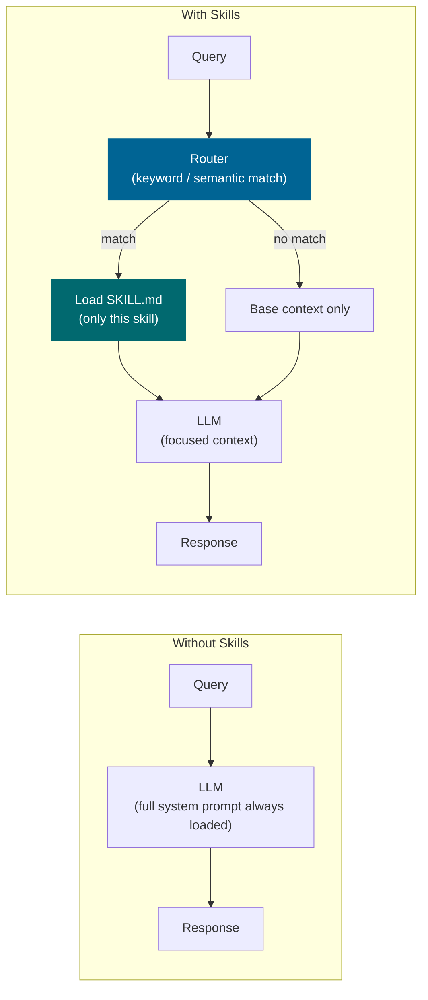

# Skills (Behavioral Instructions)

*Vol 1 · A Field Guide to AI Agent Integration Patterns*

---

## What Skills Are

A skill is a set of domain-specific instructions, typically written in natural language (Markdown), that are injected into the agent's context to guide its behavior for a particular class of task. Skills are not executable code — they are behavioral playbooks.

The defining property is **selectivity**: a skill loads only when a user request matches its declared domain. This is what distinguishes skills from steering files. A steering file is always present; a skill is present only when triggered.

> **A note on implementations:** In Claude Code, a skill lives in a `SKILL.md` file inside a `.claude/skills/` directory. This is the reference implementation for this paper. Other frameworks have analogous concepts under different names — LangChain agents can use tool descriptions with detailed behavioral instructions, AutoGen uses agent system prompts scoped to task types, and LlamaIndex agents support pluggable workflow modules. The architecture described here applies across frameworks; the `SKILL.md` convention is Claude Code-specific.

---

## How Skills Work




Skills act as **contextual modification**: they inject structured instructions, reference documentation, code patterns, and quality criteria into the agent's active context. The LLM uses those instructions to guide its reasoning and output for the duration of that task.

The agent matches the incoming user request to an available skill by reading each skill's description, loads the matching `SKILL.md` content, and proceeds. The skill can reference scripts, CLIs, or external resources — but the execution of those resources is left to the agent's interpretation of the natural-language instructions.

```
User request arrives
        ↓
Agent reads skill descriptions (metadata, ~100 tokens each)
        ↓
Best-match skill(s) identified
        ↓
Matching SKILL.md loaded into context (~3,000–5,000 tokens)
        ↓
Agent executes the task with the skill's behavioral guidance
```

The selection step is lightweight — skill descriptions are short. The full skill instructions are only loaded when triggered, which is the key economic advantage over steering files (which are always loaded).

---

## The LlamaIndex Finding: Skills vs. Live Data Sources

LlamaIndex's engineering team made an instructive observation when building LlamaAgents, their agent product for working with LlamaIndex APIs. They initially used both an MCP documentation server and custom skills to provide their coding agent with knowledge about the LlamaIndex API.

In testing, the MCP documentation server alone provided enough context for correct code generation most of the time. Skills were "rarely invoked" in ways that substantially improved results. The key variable was **data freshness**: the LlamaIndex API was changing rapidly, with new versions and deprecated methods appearing frequently. The MCP server served a live, always-current documentation source; skills reflected the state of the API at the time they were written.

Their conclusion: **if the knowledge domain changes rapidly, MCP wins** because it serves a live source of truth. **If the domain is stable, a skill is simpler and sufficient.** [Vol1-Ref-B](../references.md#vol1-ref-b)

This finding establishes one of the clearest selection criteria in the MCP-vs-skills decision: ask how fast the domain evolves. A stable code style guide is a skill. A live API documentation source is an MCP server (or at minimum, a file loaded fresh on each query rather than baked into a static SKILL.md).

---

## Strengths

- **Lightweight** — just Markdown files, no servers, no runtime dependencies
- **No infrastructure to maintain** — edit a `.md` file, done
- **Flexible and human-readable** — natural language is easier to author and review than code
- **Can encode complex multi-step workflows** — without requiring deterministic code
- **Zero network latency** — instructions are loaded locally from disk
- **Rapidly evolving** — change a skill by editing the file; no deployment pipeline required
- **Economical** — tokens are only paid when the skill is triggered, not on every query

---

## Weaknesses

- **Non-deterministic** — execution depends on the LLM's interpretation of the instructions
- **Failure mode is misinterpretation** — not a clean error; subtle drift is hard to catch
- **Requires maintenance** — must be updated manually when the domain changes
- **Not suitable for precise operations** — anything requiring exact schemas, structured auth flows, or guaranteed output format belongs in a tool, not a skill
- **Selection complexity grows with library size** — routing accuracy degrades as the skill library grows large and domains begin to overlap

---

## Good vs. Bad SKILL.md: Concrete Examples

The difference between a behavioral playbook and an unreliable pseudo-tool is clearest in the writing.

**✅ Good SKILL.md — Behavioral guidance:**

```markdown
## Report Generation

When asked to generate a report, structure it with an executive summary followed
by findings grouped by severity. Use the company's standard template tone: direct,
factual, no marketing language. Always include a "Next Steps" section. Verify that
any numbers cited match the input data before finalizing.
```

This describes *how to approach the task* and *what quality looks like*. The agent applies this guidance when generating the report; the guidance doesn't try to replace the tools that do the actual work.

---

**❌ Bad SKILL.md — Pseudo-code in a skill:**

```markdown
Step 1: Run get_data() to fetch records.
Step 2: If result.status == "error", call fallback_tool().
Step 3: For each item in results, apply transform(item).
Step 4: If count > 100, paginate using page_size=50.
```

This is not behavioral guidance — it's a script that the LLM will attempt to follow probabilistically. The conditional logic (`if result.status == "error"`) belongs in a local tool. The pagination parameters (`page_size=50`) belong in your application code. Embedded in a skill, these become hints the agent may interpret creatively, execute incorrectly, or skip entirely.

**The test:** if you removed all the code-like elements from the skill, would it still tell the agent how to *think and behave*? If yes, it's a good skill. If removing the code elements leaves nothing useful, the skill was masquerading as a tool.

---

## What Belongs in a Skill (and What Doesn't)

**Skills are the right home for:**
- How the agent should approach a class of problem ("when reviewing code, prioritize X before Y")
- Output format standards ("responses should be structured as...")
- Domain-specific terminology and conventions
- Quality criteria and definition-of-done for a task type
- Step-by-step reasoning patterns for recurring workflows

**Skills are the wrong home for:**
- Code samples or executable logic — these become behavioral hints, not instructions, and the LLM follows them probabilistically
- Conditional logic (`if X then Y else Z`) — this belongs in a local tool
- Detailed technical material — link to a reference file that loads on demand; don't embed it inline
- Universal constraints that apply to every query — those belong in a steering file

> **The clearest test:** if your `SKILL.md` reads like a script, you've turned a behavioral guide into an unreliable pseudo-tool. Extract deterministic logic into a proper local tool; keep the skill for reasoning guidance.

---

## Skill Quality Matters More Than Skill Count

A skill that fires on 60% of relevant queries is not a skill — it is an occasional hint. The target for a production skill is 90%+ activation accuracy: the skill should trigger automatically for 9 out of 10 queries that genuinely need it, without being manually invoked. [Vol2-Ref-1](../references.md#vol2-ref-1)

Structural rules for high-quality skills:

- **One skill, one domain.** A skill covering both billing inquiries and technical troubleshooting is two skills that need splitting.
- **Front-load the trigger signal.** The first sentence of the description should state precisely when this skill applies — and when it does not.
- **Use positive and negative examples.** "Use this when the user asks about X; do not use this when the user asks about Y."
- **Avoid conditional logic.** `if/then/else` belongs in a local tool.
- **Keep instructions under 5,000 tokens.** Longer content should be split or moved to linked reference files.
- **Reference files by name, not by content.** Link to external documents rather than embedding them inline.

---

## Dos and Don'ts

**Do keep Skills as natural-language behavioral guidance only.** A skill's job is to describe what the agent should do, in what order, and to what quality standard — in plain language. It is not a place for code samples, pseudocode, conditional logic, or step-by-step operational instructions with exact command strings. The moment your SKILL.md reads like a script, you've turned a behavioral guide into an unreliable pseudo-tool. Extract that logic into a proper local tool or CLI invocation.

**Don't embed logic, code samples, or conditionals in SKILL.md files.** Code samples in a skill become behavioral hints, not executable instructions. The LLM will attempt to follow them probabilistically — sometimes correctly, sometimes creatively. If you need deterministic execution, write a local tool. If you need documentation the agent references while executing a tool, link to an external file from within the skill rather than embedding it inline.

**Don't mix behavioral guidance and operational instructions in the same artifact.** A SKILL.md file should answer: "how should the agent approach this class of problem?" A local tool should answer: "what exact operation should be performed?" When these two concerns are mixed — for example, a skill that says "when you see a database error, call the rollback tool and then send a Slack alert via the MCP server" — you get a hybrid artifact that is neither a reliable behavioral guide nor a deterministic tool. Keep the layers clean.

---

*→ Next: [Chapter 5 — Steering Files](05-steering-files.md)*
*← Previous: [Chapter 3 — Local Tools & CLI](03-local-tools-and-cli.md)*
