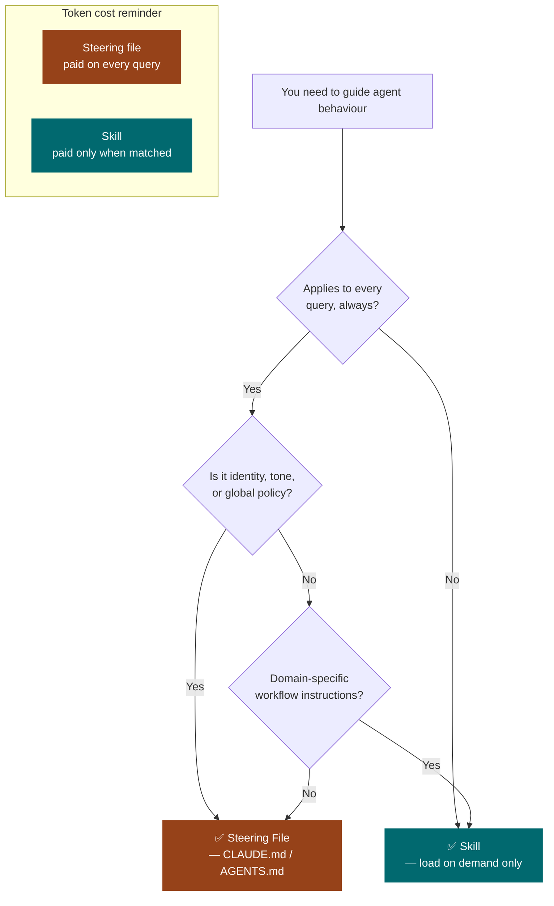

# Steering Files (Behavioral Contract Layer)

*Vol 1 · A Field Guide to AI Agent Integration Patterns*

---

## What Steering Files Are

A steering file is a persistent, plain-text document that the agent reads at the start of every session — before any user message arrives, before any tool is called. It is **always loaded and always present**. Unlike a skill, which fires on-demand when a query matches its domain, a steering file contributes to every interaction without exception.

Common forms include `CLAUDE.md` (Claude Code), `AGENTS.md` (the broader agentic ecosystem and Linux Foundation AAIF standard), `GEMINI.md` (Google Gemini CLI), `.github/copilot-instructions.md` (GitHub Copilot), and `.cursor/rules/*.mdc` (Cursor). All serve the same architectural role: they define the agent's **standing behavioral contract** for a workspace or session.

See [Vol 3, Chapter 4](../vol3/04-steering-file-design.md) for an exhaustive treatment of what belongs in steering files, the naming landscape across tools, and the docs-as-policy trap. This chapter covers the integration-pattern trade-offs.

---

## The Skill vs. Steering File Decision

The most common confusion in agent development is whether something belongs in a steering file or a skill. The difference is **selectivity**:

| | Steering File | Skill |
|--|--------------|-------|
| **When it applies** | Every interaction, always | Only when triggered by matching query |
| **Token cost** | Paid on every query | Paid only when activated |
| **Best for** | Universal constraints, project identity | Domain-specific behavioral guidance |
| **Selection** | None — always loaded | Requires routing match to activate |
| **Failure mode** | Context bloat, accuracy degradation | Missed invocation (56% non-trigger rate without explicit instructions) |

When in doubt, **default to a skill**. Every byte in a steering file is paid for on every query, whether or not it's relevant. Steering files that grow into comprehensive documentation impose a permanent overhead tax.

---

## What the Research Says

Two independent 2026 studies measured steering file performance directly.

**Gloaguen et al.** (arXiv:2602.11988, Feb 2026) evaluated CLAUDE.md and AGENTS.md files across 300+ coding tasks on multiple frontier models. [Vol1-Ref-H](../references.md#vol1-ref-h)

Key findings:
- **LLM-generated context files**: −0.5 to −2% task success, +20–23% inference cost
- **Human-written context files**: +4% task success at +19% cost overhead
- Critical nuance: context files help when documentation is otherwise absent; hurt when redundant with existing docs
- Recommendation: *"describe only minimal requirements"* — context files should contain tooling-specific instructions that can't be inferred from the codebase, not general documentation

**Vercel engineering** (Jan 2026) tested four configurations for providing agents with Next.js 16 API knowledge. [Vol1-Ref-I](../references.md#vol1-ref-i)

Key findings:
- **Skills alone** (default behavior): 0% improvement over 53% baseline — the skill was not triggered 56% of the time
- **Skills with explicit `AGENTS.md` trigger instructions**: improvement, but still below the winning approach
- **Compressed 8KB `AGENTS.md` docs-index** (pointer map to doc files, not full docs): **100% pass rate**
- Mechanism: *"no decision point"* — passive context beats on-demand retrieval when knowledge is needed reliably on every turn
- The winning format: a compact pointer map to retrievable files, not full documentation embedded inline

> **The implication of Vercel's finding:** the steering file's job is to *orient* the agent — "for workspace semantics, call this tool; for domain knowledge, see this skill" — not to document everything. A 5-line pointer file that reliably drives agents to the right resources outperforms a 5,000-token documentation file on every dimension.

---

## Heavy Steering Files Empirically Reduce Accuracy

This is worth stating explicitly, because the intuition points the wrong way. Engineers often assume that more context → better agent behavior. The research says the opposite for steering files.

Gloaguen et al. found that LLM-generated context files (the kind you'd produce by asking an LLM to document your codebase) reduce task success by 0.5–2% while increasing inference cost by 20–23%. Even human-written context files, though net positive, cost 19% more in tokens for a 4% quality gain. Heavy context files that try to document everything produce a net-negative return on investment in most cases.

The mechanism is context dilution: every byte in the steering file is a byte the model must de-weight or ignore when it's not relevant to the current query. The more there is, the more noise the model has to reason through to find the signal.

> **Flag for teams building local AI packages:** Many teams reach for `CLAUDE.md` as the first thing they build. This is often the wrong order. Build your local tools first. Write skills for domain-specific behavioral guidance. Keep steering files minimal. Add to them only when you have content that genuinely must apply to every single interaction.

---

## The Cross-Vendor Landscape

A pattern this universal hasn't emerged by coincidence. Every team building an AI coding agent independently reached the same conclusion: agents need ambient project context that is always present, zero-cost to invoke, and version-controlled alongside the code. The steering file is the ecosystem's answer to "how do we give agents project memory without building a database?"

| Tool | File Name |
|------|-----------|
| Claude Code (Anthropic) | `CLAUDE.md` |
| OpenAI Codex | `AGENTS.md` |
| Google Gemini CLI | `GEMINI.md` |
| GitHub Copilot | `.github/copilot-instructions.md` |
| Cursor | `.cursor/rules/*.mdc` |
| Windsurf (Codeium) | `.windsurfrules` |
| Aider | `CONVENTIONS.md` |

In December 2025, the Linux Foundation formalized this convergence by launching the Agentic AI Foundation (AAIF) with `AGENTS.md` as one of three founding project contributions, alongside Anthropic's MCP and Block's Goose. Founding members include Anthropic, OpenAI, Google, Microsoft, Amazon, Block, Bloomberg, and Cloudflare. [Vol3-Ref-4](../references.md#vol3-ref-4)

**The practical implication:** a well-written steering file is not tool-specific. A carefully maintained `AGENTS.md` (or whichever name your toolchain uses) provides context to Claude Code, OpenAI Codex, Google Gemini CLI, GitHub Copilot, Cursor, and more — without per-tool configuration. Write once, inform all agents.

---

## Strengths

- **Zero invocation overhead** — always present, no trigger logic to get wrong
- **Right choice for universal constraints** — project identity, standing rules, things the agent must never do
- **A minimal pointer file reliably drives agent behavior** without context bloat (validated empirically by Vercel)
- **Version-controlled with the codebase** — changes to agent behavior are tracked in git

---

## Weaknesses

- **Zero selectivity** — every token is paid for on every query, whether relevant or not
- **Heavy files empirically reduce accuracy and increase cost** vs. baseline [Vol1-Ref-H](../references.md#vol1-ref-h)
- **Changes require editing the file and restarting the agent session** — no hot-reload
- **Silent failure mode** — the LLM may under-weight instructions buried deep in a long file (the lost-in-the-middle effect)

---

## Practical Rules for Steering Files

1. **Keep them minimal** — universal rules, project identity, and standing constraints only
2. **Use a compact pointer index** (like Vercel's 8KB docs-index) rather than embedding full domain knowledge inline
3. **Move domain-specific knowledge to skills** — where it loads only when needed
4. **Treat content that doesn't apply to every query as dead weight** — remove it
5. **Review and trim regularly** — steering files accumulate over time; they rarely shrink on their own

---

## Dos and Don'ts

**Do keep steering files minimal.** Universal rules, project identity, standing constraints, and a compact pointer index to skills/resources. If a piece of content doesn't apply to every single query, it shouldn't be in the steering file — it belongs in a skill that loads on demand.

**Do use a compact pointer index, not embedded documentation.** The Vercel finding is the right mental model: a 5–20 line pointer file that says "for workspace semantics, call describe-tool; for domain knowledge, see `.claude/skills/`" reliably drives agent behavior. Full documentation embedded in the steering file costs performance without proportionate benefit.

**Don't load full domain knowledge into the steering file.** Every byte in CLAUDE.md / AGENTS.md is paid for on every query. Research shows LLM-generated context files reduce task success by 0.5–2% [Vol1-Ref-H](../references.md#vol1-ref-h). Domain-specific knowledge belongs in skills, where it only loads when triggered.

**Don't confuse "important" with "universal."** A rule that's critical for one type of task is not necessarily universal. If it doesn't apply to every query, it's a skill candidate, not a steering file candidate. The selectivity boundary is the entire point.

---

*→ Next: [Hooks (Event-Driven Automation)](06-hooks.md)*
*← Previous: [Chapter 4 — Skills](04-skills.md)*
