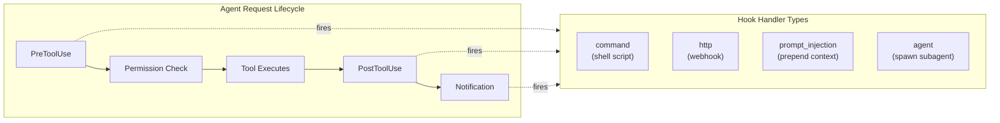

# Hooks (Event-Driven Automation)

*Vol 1 · A Field Guide to AI Agent Integration Patterns*

---

## What Hooks Are

A hook is a user-defined command, HTTP endpoint, LLM call, or subagent that the agent framework executes automatically at a specific lifecycle point — before a tool call fires, after a file write completes, when a session starts, when a permission prompt appears. Hooks provide **deterministic, event-driven control**: they fire unconditionally based on lifecycle events, not on the LLM deciding to invoke them.

This is what makes hooks architecturally distinct from every other pattern in this guide. They are not tools — the LLM never invokes them. They are not skills — they execute code, not behavioral prose. They are not MCP — they are local lifecycle callbacks, not a connectivity protocol. They are not steering files — they enforce through execution, not language.

**The defining property:** if the event fires and the matcher matches, the hook runs. Full stop. No model decision involved.

---

## How Hooks Work (Claude Code Reference Implementation)




In Claude Code, hooks are configured in `settings.json` (at global, project, or organization-policy scope) under a `hooks` key. Each entry specifies a lifecycle event, an optional matcher to filter by tool name or condition, and one or more handlers to execute.

When an event fires, Claude Code sends structured JSON to the handler via stdin — including session ID, working directory, tool name, and tool arguments — and reads the handler's response from stdout, stderr, and exit code.

**Communication protocol:**

| Exit Code | Meaning |
|-----------|---------|
| `0` | No objection — proceed normally |
| `2` | Block the action — send stderr to Claude as feedback |
| Other non-zero | Produce a transcript warning, proceed anyway (easy to miss in production) |

A JSON object on stdout enables finer control: approve or deny permission requests, modify tool inputs before execution, inject context into the session, or resume a stopped turn.

---

## Key Lifecycle Events

Claude Code defines 29 lifecycle events. The most architecturally significant:

| Event | When it fires and what the hook can do |
|-------|---------------------------------------|
| **SessionStart** | Fires when a session begins, resumes, or context is compacted. Output is injected into Claude's context. Useful for re-injecting critical state after compaction. |
| **PreToolUse** | Fires before a tool call executes. Can block the call (exit 2), modify tool inputs (JSON output), or auto-approve. **Fires before permission checks — blocks even in `bypassPermissions` mode.** |
| **PermissionRequest** | Fires when a permission dialog is about to appear. Can auto-approve or escalate programmatically. |
| **PostToolUse** | Fires after a tool call succeeds. Cannot undo the action. Good for cleanup, auto-formatting, audit logging. |
| **PostToolBatch** | Fires after all parallel tool calls in a batch complete. Useful for batch validation before the next model call. |
| **Stop** | Fires when Claude finishes a response. A prompt-based or agent hook returning `{"ok": false, "reason": "..."}` forces Claude to continue working. |
| **SessionEnd** | Fires when the session terminates. Useful for cleanup and final audit writes. |

> **Important:** `PreToolUse` hooks fire **before permission checks** and can block even when `bypassPermissions` is enabled. This is the only mechanism that enforces policy the user cannot bypass — it is the hardest enforcement guarantee in the entire stack.

---

## Hook Handler Types

| Type | How it works |
|------|-------------|
| **command** | Runs a shell command. Receives JSON on stdin; returns decisions via exit code and stdout/stderr. Most common type. |
| **http** | POSTs event data to an HTTP endpoint. The endpoint returns the same JSON format as command hooks. Useful for shared audit services, team-wide enforcement, or cloud functions. |
| **prompt** | Single LLM call (Haiku by default) to make a judgment decision. Returns `{"ok": true/false, "reason": "..."}`. Use when the decision requires language understanding, not just pattern matching. |
| **agent** | Spawns a subagent with full tool access to inspect files, run tests, or verify conditions before returning a decision. Longer timeout (60 s, up to 50 tool turns). Use when verification requires checking actual codebase state. |

The range from simple shell commands to full subagents covers the full spectrum from deterministic rules to judgment-based verification — all with the same unconditional execution guarantee.

### Minimal Working Example

A `PreToolUse` command hook that blocks writes to sensitive files. This is the simplest useful hook and a good starting point for any project:

```json
// .claude/settings.json
{
  "hooks": {
    "PreToolUse": [
      {
        "matcher": "Write",
        "hooks": [
          {
            "type": "command",
            "command": "bash -c 'input=$(cat); file=$(echo \"$input\" | python3 -c \"import sys,json; print(json.load(sys.stdin)[\\"tool_input\\"][\\"path\\"])\"); case \"$file\" in *.env|*secrets*|*credentials*) echo \"{\\\"decision\\\": \\\"block\\\", \\\"reason\\\": \"Writes to .env and credentials files are blocked by policy\"}\" && exit 2;; esac'"
          }
        ]
      }
    ]
  }
}
```

What this does: every time the agent attempts a `Write` tool call, the hook receives a JSON blob on stdin containing the tool name and arguments (including the target `path`). The shell script extracts the path and pattern-matches against sensitive filenames. If it matches, the hook exits with code `2` and prints a JSON block decision — Claude Code reads this, blocks the write, and shows the reason to the user. If it doesn't match, the hook exits `0` and the write proceeds normally.

**The stdin JSON shape** (what every `PreToolUse` hook receives):
```json
{
  "session_id": "abc123",
  "hook_event_name": "PreToolUse",
  "tool_name": "Write",
  "tool_input": {
    "path": "/project/src/.env",
    "content": "..."
  }
}
```

**Exit code protocol:** `0` = allow and proceed; `2` = block with the JSON decision printed to stdout as the reason; any other non-zero = warning logged, execution proceeds anyway.

---

## Why Hooks Are Architecturally Distinct

Hooks fill a tier that none of the other patterns can fill:

```
The Five Patterns and What They Can't Do:

  Skills          → Can't enforce unconditionally (require LLM invocation decision)
  Local Tools     → Can't enforce unconditionally (require LLM tool-call decision)
  Steering Files  → Can't enforce through execution (language-based, probabilistic)
  MCP             → Can't intercept local lifecycle events (connectivity protocol)

  Hooks           → Enforce deterministically at lifecycle events ✓
                    Fire regardless of LLM judgment ✓
                    Can block, modify, or approve ✓
```

This makes hooks the right answer specifically for operations that **must happen regardless of what the LLM decides**:

- **Safety guardrails** — block `rm -rf` before it executes, not after
- **Compliance logging** — write every tool call to an immutable audit trail
- **Code quality enforcement** — run `prettier` after every file write, unconditionally
- **Context contracts** — re-inject critical state after compaction truncates it
- **Permission automation** — auto-approve plan exits without a dialog interrupt
- **File protection** — prevent writes to sensitive files regardless of agent intent

---

## Cross-Framework Equivalents

The lifecycle-callback pattern is not unique to Claude Code. Every major agent framework implements it. The concept — intercept at lifecycle events, optionally block or modify — is universal; only the API surface and configuration style differ.

| Framework | Concept name | Registration | Pre-exec blocking? | Key events |
|-----------|-------------|-------------|-------------------|------------|
| **Claude Code** | Hooks | Declarative — `settings.json`; no code required for simple cases | **Yes** — `PreToolUse`; fires before permission checks; blocks even in `bypassPermissions` mode | `SessionStart`, `PreToolUse`, `PermissionRequest`, `PostToolUse`, `PostToolBatch`, `Stop`, `SessionEnd`, `ConfigChange` (29 total) |
| **OpenAI Agents SDK** | Lifecycle Hooks + Guardrails | Code-first — subclass `RunHooksBase` or `AgentHooksBase`; attach via runner or `agent.hooks` | **Guardrails only** (Input/Output/Tool guardrails raise tripwire exception to halt). Hooks are observation-only — they cannot block | `on_agent_start/end`, `on_llm_start/end`, `on_tool_start/end`, `on_handoff`; guardrails run on input, output, and per tool invocation [Vol1-Ref-Hooks](../references.md#vol1-ref-hooks) |
| **LangChain / LangGraph** | Callbacks | Code-first — subclass `BaseCallbackHandler`; pass to chain, agent, or tool constructor | **Yes** — raise an exception inside `on_tool_start` or `on_llm_start` to abort execution | `on_llm_start/end`, `on_tool_start/end`, `on_chain_start/end`, `on_agent_action`, `on_agent_finish`; LangGraph adds node-level before/after hooks [Ref M](../references.md#vol1-ref-hooks) |
| **Google ADK** | Callbacks + Plugins | Code-first — pass callback functions to agent constructor; Plugins attach globally to the Runner | **Yes** — `before_tool_callback` or `before_model_callback` returns a value to short-circuit execution entirely | `before/after_agent`, `before/after_model_call`, `before/after_tool`; Plugins extend this globally across all agents in the Runner [Ref N](../references.md#vol1-ref-hooks) |

[Vol1-Ref-Hooks](../references.md#vol1-ref-hooks)

**The practical implication for local package builders:** the enforcement use cases described above — blocking dangerous operations, auto-formatting, audit logging, context re-injection — are achievable in any of these frameworks. The architecture decision is the same regardless of which one you're using. Deterministic, event-driven enforcement belongs in this layer, not in tools or skills.

If you're building on OpenAI's Agents SDK: use Guardrails for enforcement and hooks for observation. If you're building on LangChain: implement `BaseCallbackHandler`. If you're using Google ADK: register `before/after_tool_callback` on the agent or a Plugin on the Runner.

---

## Strengths

- **Unconditional execution** — fires deterministically regardless of LLM judgment; the LLM never decides whether to invoke a hook
- **`PreToolUse` fires before permission checks** — the only way to enforce policy the user cannot bypass
- **Can block, modify, approve, or inject** — full range of enforcement and automation actions
- **Scoped policy** — hooks can be set at project, user, or organization scope
- **Cross-cutting concerns in one place** — safety guardrails, audit logging, auto-formatting — without touching tool or skill code

---

## Weaknesses

- **Framework-specific configuration** — the lifecycle-callback concept is universal, but each framework has its own API surface. The `settings.json` + shell script model and the specific 29-event set are Claude Code-specific.
- **`PostToolUse` hooks cannot undo completed actions** — prevention must happen at `PreToolUse`
- **Race conditions with multiple hooks** — multiple hooks writing `updatedInput` in parallel create a last-write-wins collision; avoid having more than one hook modify the same tool's input
- **Non-zero exit codes other than `2` produce warnings and proceed** — failures are easy to overlook in production
- **Infrastructure overhead** — hook scripts must be stored, versioned, made executable, and tested separately from the main agent code

---

## The Place of Hooks in the Local Package Context

For local AI packages, hooks are valuable for:

- **File protection** — preventing the agent from writing to sensitive paths
- **Auto-formatting** — running formatters after every code write without relying on the agent to remember
- **Audit trails** — logging every tool call to a local file for debugging and observability
- **Context re-injection** — re-adding critical instructions that may have been compressed out of the active context in long sessions

Don't put business logic in hooks. A hook that validates an input, logs a call, or blocks a dangerous pattern is doing exactly what hooks are for. A hook that orchestrates multi-step workflows or encodes domain rules is abusing the hook layer — that logic belongs in a local tool or an agent.

> **The practical test:** if the hook would still make sense in a completely different project with a completely different domain, it's infrastructure and belongs in a hook. If it's domain-specific, move it to a local tool.

## Dos and Don'ts

**Do use hooks for unconditional enforcement.** Any operation that must happen regardless of the LLM's judgment — blocking dangerous commands, auto-formatting files, logging every tool call, protecting sensitive files from writes — belongs in a hook, not a tool or skill. Tools depend on the LLM deciding to call them; skills depend on the LLM interpreting instructions correctly. Hooks fire unconditionally. Use that guarantee for safety-critical and compliance-critical operations.

**Don't put business logic in hooks.** Hooks are enforcement and automation infrastructure, not a place for domain logic. A hook that validates an input, logs a call, or blocks a dangerous pattern is doing exactly what hooks are for. A hook that orchestrates multi-step workflows, makes API calls to implement features, or encodes business rules is abusing the hook layer. That logic belongs in a local tool or an agent.

---

*→ Next: [Chapter 7 — Head-to-Head Comparison & Context Economics](07-comparison-and-economics.md)*
*← Previous: [Chapter 5 — Steering Files](05-steering-files.md)*
