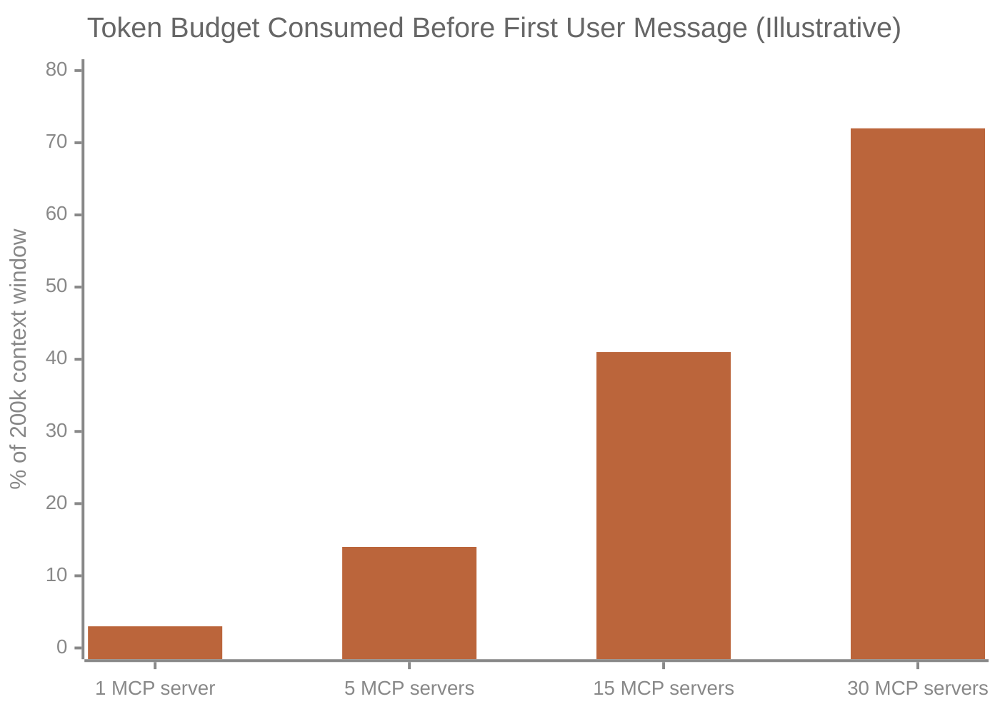

# Head-to-Head Comparison & Context Economics

*Vol 1 · A Field Guide to AI Agent Integration Patterns*

---

## Head-to-Head Comparison

The following matrix covers the most critical dimensions for choosing an integration pattern. Read it alongside the decision framework in [Chapter 1](01-foundations.md#the-decision-framework).

| Dimension | Local Tools | Skills | CLI Tools | Steering Files | Hooks | MCP |
|-----------|-------------|--------|-----------|----------------|-------|-----|
| **Setup complexity** | Low (code only) | Very low (Markdown) | Very low (CLI exists) | Very low (text file) | Very low (settings.json + script) | Medium–High (server process) |
| **Execution model** | Deterministic API call | LLM interprets instructions | Shell subprocess call | No execution; always-loaded | Deterministic; unconditional event-driven | Deterministic JSON-RPC call |
| **Context window cost** | All schemas every request | Skill file per invocation | Low (prompt/command) | Every session, every query | None (runs outside LLM context) | Dynamic; can be high at scale |
| **Portability** | Low (tied to model API) | Medium (model-agnostic text) | Low (shell-dependent) | High (plain text, any agent) | Low (Claude Code-specific) | High (any MCP client) |
| **Network latency** | None (in-process) | None (local file) | None (local subprocess) | None | None (local; possible with HTTP hooks) | Low–High (depends on transport) |
| **Credential isolation** | Client-side | N/A | Client-side | N/A | Client-side (server-side with HTTP hooks) | Server-side (strong isolation) |
| **Maintenance** | Code deployments | Edit Markdown file | Update the CLI | Edit file, reload session | Edit settings.json + hook scripts | Server updates propagate to all |
| **Multi-agent reuse** | Low | Medium (shared files) | Medium (shared binary) | High (shared workspace file) | Medium (shared via project settings) | High (one server, many clients) |
| **Failure mode** | Hard error / exception | LLM misinterpretation | Shell exit code / stderr | LLM de-weights or ignores | Script error / blocked event | Protocol error / server down |
| **Best for** | Simple, fast in-process ops | Behavioral guidance & know-how | Existing CLI operations | Universal rules, project identity | Cross-cutting enforcement (safety, audit, auto-format) | Standardized external connectors |

---

## Cost & Performance Trade-offs

### Context Window Economics

*The bars above are modeled projections anchored to two measured data points (the Anthropic 55k-token multi-server figure and the Apideck 3-server measurement). They illustrate the scaling trend; they are not four independently measured values. See the sourcing notes below.*

Context window usage is one of the least-discussed but most practically important dimensions of tool architecture. Every token in the context window costs money and (more importantly) reduces the space available for actual user content and reasoning.

### Production numbers and sourcing notes

The scale of the problem is real and documented. A note on evidence quality follows each figure.

- Anthropic's tooling documentation reports that a typical multi-server MCP setup (GitHub, Slack, Sentry, Grafana, Splunk) can consume **~55,000 tokens** in tool definitions before any conversation starts. [Vol1-Ref-A](../references.md#vol1-ref-a) *(Primary source: official Anthropic documentation.)*

- Apideck measured 3 MCP servers (GitHub, Slack, Sentry) consuming **143,000 of a 200,000-token context window** — 72% — before any conversation began. [Vol1-Ref-C](../references.md#vol1-ref-c) *(Single-origin measurement: this figure has been widely reproduced across the industry, but every instance traces back to this one Apideck blog post. Apideck sells a CLI alternative to MCP. Treat it as a representative data point and directional signal, not an independently verified constant.)*

- Denis Yarats (Perplexity CTO) cited context window overhead as a key reason Perplexity moved away from MCP, announcing the decision at the Ask 2026 conference (March 11, 2026). [Vol1-Ref-D](../references.md#vol1-ref-d) *(The underlying event is broadly corroborated by multiple independent write-ups from the conference; the cited source is a secondary aggregator. See reference annotation for better primary coverage.)*

- Cloudflare's Code Mode demonstrated a **244× token reduction** (1,000 tokens vs. 244,000) by having models write code against pre-authorized API clients rather than exposing individual endpoints as MCP tools. Exposing the full Cloudflare API as MCP tools would require **1.17 million tokens**. [Vol1-Ref-E](../references.md#vol1-ref-e) *(Note: the comparison baseline — the full Cloudflare API exposed as MCP tools — is a pathological case no real implementation would use. The 244× figure illustrates the ceiling of naive MCP exposure, not typical practice. The directional finding (pre-authorized clients dramatically outperform tool-per-endpoint) is sound.)*

- Function calling at 50 tools can spend **10,000–20,000 tokens** on tool descriptions before reading the user's message.

### Token cost by pattern (approximate)

| Tool Count | Approx. Token Cost (schemas only) | Impact |
|-----------|----------------------------------|--------|
| 1–5 tools | 200–800 tokens | Negligible |
| 10–20 tools | 2,000–6,000 tokens | Moderate; noticeable on small models |
| 30–50 tools | 8,000–20,000 tokens | Significant; can crowd out useful context |
| 50+ tools | 20,000–60,000+ tokens | Often prohibitive; model accuracy degrades |

*Based on Anthropic claude-3-5-sonnet tokenizer at time of writing; schema complexity varies. Tokenizer behavior changes across model generations — treat these as order-of-magnitude estimates, not precise constants.*

---

### Latency

For real-time or interactive applications, latency matters. From fastest to slowest:

| Pattern | Typical Latency | Bottleneck |
|---------|----------------|------------|
| Local Tool (in-process) | <1 ms for the function call itself | LLM inference time dominates |
| CLI Tool (subprocess) | 10–100 ms process startup | Process spawn overhead |
| MCP STDIO (local subprocess) | 5–50 ms per call | JSON-RPC serialization + IPC |
| MCP Streamable HTTP (local) | 20–200 ms per call | HTTP stack overhead |
| MCP Streamable HTTP (remote) | 50 ms – 2+ seconds | Network + server processing |

For local packages where all computation is local, the latency difference between function calling and STDIO MCP is often negligible for user-perceived performance. The difference becomes relevant in tight loops (agents making many sequential tool calls) or when targeting sub-100ms response times for UI interactions.

---

### Operational Complexity

The hidden cost of MCP for local packages is operational complexity: the MCP server needs to start before the agent can use it, must be restarted when it crashes, and must be upgraded when the protocol or data model changes. In a local package this means:

- The package must start and manage the MCP server process as a subprocess, **or**
- The user must remember to start the MCP server before running the package

Neither is terrible, but both add friction compared to function calling, where there is no separate process. For tools you distribute to other developers, this friction multiplies — they need to install, configure, and manage the server in addition to the package itself.

---

## The Hybrid Pattern for Local Packages

The most practical architecture for a local AI package combines all five patterns with each doing what it does best:

| Layer | Pattern | Responsibility |
|-------|---------|---------------|
| Always-on contract | **Steering File** | Universal project conventions, compact pointer index to skills and resources. *Keep it minimal — heavy files reduce accuracy.* |
| Unconditional enforcement | **Hooks** (PreToolUse / PostToolUse) | Safety guardrails, audit logging, file protection, auto-formatting |
| Core operations | **Local Tools** | File reading, text processing, computation, local API calls, environment inspection |
| Shell operations | **CLI Tools** | git, jq, ripgrep, sqlite3 and other existing tools |
| Behavioral customization | **Skills** | How the LLM should reason about your domain, output format standards, step-by-step workflows |
| External connectors | **MCP** (only when justified) | External SaaS with official servers, capabilities shared across multiple agent clients |

This hierarchy keeps the architecture simple and inspectable while leaving the door open for MCP when its benefits genuinely outweigh its costs.

---

*→ Next: [Chapter 8 — The Local AI Package Context & Scenarios](08-local-package-guide.md)*
*← Previous: [Chapter 6 — Hooks](06-hooks.md)*
