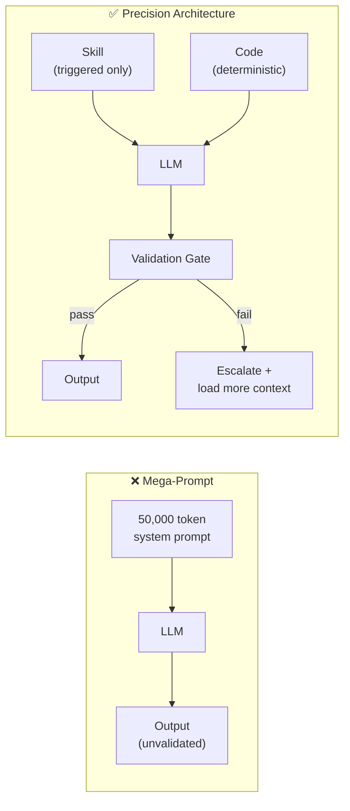

# The Problem: Why Mega-Prompts Break

*Vol 2 · Precision Agents*

---

## The Trap

Most AI systems start the same way: a developer discovers that a large, detailed system prompt makes the model behave better, so they keep adding to it. New policies, edge cases, domain knowledge, workflow instructions. The prompt grows. At first, quality improves. Then, subtly, it starts to degrade.

This is the **mega-prompt trap**, and it has three compounding failure modes that, together, create a ceiling on how good a monolithic system can get.

---

## Failure Mode 1: The Token Tax

Every token in the context window costs money and consumes space that could otherwise hold useful content. A well-intentioned 50,000-token system prompt — carrying every policy, workflow, and edge case your organization has documented — is paid for on every single interaction, whether or not the current query touches any of that content. It is, as one industry analysis put it, *"a recurring tax on every interaction."* [Ref 1](../references.md#vol2-ref-1)

The scale compounds quickly. A modest multi-server MCP setup can add another 55,000+ tokens of tool definitions [Ref A, Vol 1](../references.md#vol1-ref-a). A growing skill library contributes further. Before the user's first message arrives, agents in production environments can exhaust **40–72% of their available context window** on definitions, instructions, and schemas that are irrelevant to the current task. [Ref C, Vol 1](../references.md#vol1-ref-c)

---

## Failure Mode 2: The Lost-in-the-Middle Effect

Research has documented a consistent **U-shaped attention curve** in how language models process long contexts: instructions at the very beginning and very end of a prompt get followed reliably, while instructions buried in the middle are systematically under-weighted, missed, or ignored. [Liu et al. 2023, Ref 1a](../references.md#vol2-ref-1a), [Ref 1](../references.md#vol2-ref-1)

A 50,000-token system prompt means that most of what you wrote will be in the middle. The more carefully you documented your edge cases, the more likely they are to be in the silent zone.

This effect is a robustly observed empirical phenomenon. It's worth noting that it is not a fixed, immutable structural property: newer long-context models have shown meaningfully flatter performance curves as retrieval architectures improve. The U-shape is real and consistent enough to design around, but it does not apply uniformly across all model generations. **The fix is not better prompting; it is shorter, more focused contexts** — a recommendation that holds regardless of how flat the curve becomes.

---

## Failure Mode 3: Ambiguity Amplification

When the context window contains many tools, many skills, and many instructions that could plausibly apply to a given query, the model must choose between them. Near-duplicate tools, overlapping skill domains, and conditional instructions that cover similar cases all create decision points where the model's interpretation determines the outcome — inconsistently across runs.

More context, when it is unstructured and broad, adds noise rather than signal. The result is hallucination, incorrect tool selection, and subtle behavior drift that is hard to debug because no single instruction is wrong. The system looks fine until it doesn't, and the failure mode is distributed across many interactions rather than concentrated in one.

---

## The Accuracy Ceiling of Prompt Engineering

Vendor analysis from 2026 documents a practical ceiling for how much prompt engineering alone can improve a system. [Ref 7](../references.md#vol2-ref-7) *(Note: this is a directional signal from a vendor analysis blog, not a peer-reviewed measurement. The specific 75% figure should be read as an order-of-magnitude estimate, not a precise constant — different domains and task types will produce different ceilings. The underlying argument — that architectural changes outperform further wordsmithing — is independently supported by the structural failure modes above.)*

Across complex multi-step reasoning tasks, practitioners consistently hit diminishing returns from prompt engineering well before reaching high accuracy. Further gains require architectural changes — modular design, evaluation pipelines, structured validation — not more carefully worded instructions. Teams that try to push past this ceiling with longer and more detailed prompts typically see diminishing returns after the first 5,000–10,000 tokens of system instructions.

This is the fundamental case for the architecture in this volume: **the limits of the mega-prompt are structural, not rhetorical.** You cannot word your way past the U-shaped attention curve. You cannot token your way past the context tax. The architecture has to change.

---

## What Changes

The shift from mega-prompt to precision architecture is not a single change — it's a set of compounding design decisions:

| Mega-Prompt | Precision Architecture |
|-------------|----------------------|
| Load everything upfront | Load minimum needed, expand on failure |
| One large agent | Modular subagents with focused scope |
| LLM decides everything | Code handles deterministic operations |
| Natural language output | Structured output validated by code |
| Retries for failures | Targeted escalation with root-cause labels |
| No measurement | Single-pass success rate tracked per skill |
| Context grows indefinitely | Context compressed at every handoff |

The solution to mega-prompt failures is not a better mega-prompt. It is a progressive architecture: load only what is needed for the task at hand, validate the output, and escalate with more context only when the validation fails.

The rest of this volume covers each component of precision architecture in depth.

---

*→ Next: [Chapter 2 — The Code-First Rule & Modular Design](02-code-first-and-modular.md)*
*← [Back to Vol 2 Overview](00-overview.md)*
