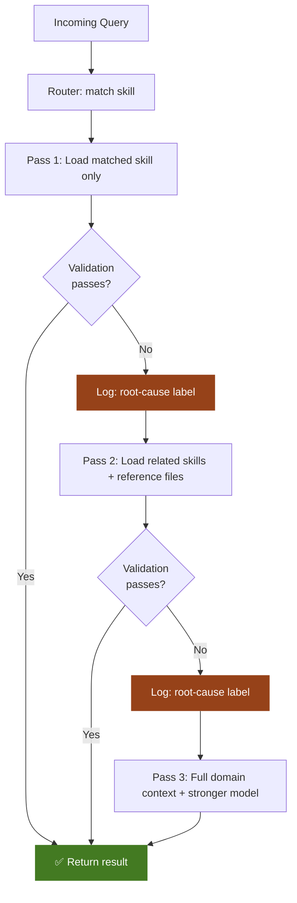

# Progressive Context Loading

*Vol 2 · Precision Agents*

---

## The Pattern

Progressive context loading is the architectural pattern that enables modular agents to scale. Rather than loading all relevant context upfront, the system loads context in tiers: the minimum needed for the most common cases first, expanding only when the initial context proves insufficient.

This matches a fundamental economic reality: **the cost of loading context is paid on every invocation, but the cost of loading insufficient context is paid only on failures** — which in a well-tuned system are the minority. Optimize for the common case; handle the exceptions with targeted expansion.

---

## The Knowledge Hierarchy

Think of your domain knowledge as a taxonomy with four tiers:

| Level | Scope | When Loaded | Approx. Token Cost |
|-------|-------|------------|-------------------|
| **Metadata** | Skill names and one-line descriptions | Every invocation | ~100 tokens/skill |
| **Skill Instructions** | Full SKILL.md body for matched skill(s) | On skill match | 3,000–5,000 tokens |
| **Reference Material** | Linked docs, runbooks, API specs | On explicit need | 5,000–20,000 tokens |
| **Domain Library** | Full domain knowledge base | Escalation only | 20,000–100,000+ tokens |

**The key constraint:** the system, not the LLM, decides when to escalate. Escalation is triggered by code-side validation failure, not by the model asking for more context.

**In practice:** a query about a specific crankshaft sensor failure loads the crankshaft skill (Tier 2). If that skill's instructions reference an API spec for a specific sensor, the system loads that spec (Tier 3) when the skill explicitly asks for it. Only if the crankshaft skill and its references are insufficient does the system escalate to the full engine library (Tier 4).

---

## Routing: The Entry Point to Progressive Loading

The routing step is where queries get matched to skill subsets. Before any LLM call is made, the system inspects the incoming query and identifies which skills to load.

### Option 1: Keyword Routing (Start Here)

Inspect the incoming text for domain-specific signals — product names, error codes, technical terminology, command patterns — and use these to select the relevant skill subset.

**Advantages:** requires no LLM invocation, no vector database, no network call. Deterministic, fast, and easy to debug.

**Limitation:** lower recall for queries using synonyms, paraphrases, or domain-adjacent language that doesn't exactly match the keyword dictionary.

**When to use:** start here, always. Keyword matching handles the majority of production queries in most systems. Add more sophisticated routing only when measured recall falls below target.

---

### Option 2: Semantic Routing (When Keyword Recall Isn't Enough)

Use embedding-based similarity to match queries to skills by meaning rather than exact text. Embed each skill's name and description at indexing time. At inference time, embed the query and retrieve the top-k most similar skills.

**Advantages:** captures paraphrases, synonyms, and domain-adjacent language that keyword matching misses.

**Trade-offs:** requires an embedding model and vector store. One embedding call and one similarity search per query. Adds infrastructure dependencies.

**When to use:** when keyword routing leaves a material recall gap, measured by false negatives in your routing validation.

---

### Option 3: LLM-Based Routing (At Scale, with Overlapping Domains)

At scale — when skill libraries grow to hundreds of entries and semantic similarity produces too many false positives (multiple near-identical skills for overlapping domains) — use a lightweight model to read skill metadata and select the appropriate skills.

SkillRouter (arXiv:2603.22455, March 2026) formalizes this as a 1.2B parameter retrieve-and-rerank pipeline achieving 74% top-1 routing accuracy at 80,000-skill scale. The key finding: routing accuracy improves significantly when the routing model can access the full skill body (not just the name and description), because the skill body contains the most discriminative signals for overlapping domains. [Ref 2](../references.md#vol2-ref-2)

**When to use:** for large platform agents with extensive skill libraries. For most local AI packages, keyword or semantic routing is sufficient.

---

## The Multi-Pass Escalation Ladder

Combining progressive context loading with structured validation creates a multi-pass architecture. Each pass uses more context than the previous one, is triggered only by the failure of the previous pass, and succeeds on a larger fraction of the remaining queries.

| Pass | Context Loaded | Validation Gate | Target Success Rate |
|------|---------------|----------------|---------------------|
| **Pass 1 (Fast Path)** | Skill metadata + matched skill(s) | Schema + confidence score | ~80% of all queries |
| **Pass 2 (Expanded)** | Pass 1 context + reference material from skill | Schema + confidence score + constraint checks | ~15% of all queries |
| **Pass 3 (Full Domain)** | Full domain library for the matched area | Comprehensive validation | ~4% of all queries |
| **Pass 4 (Escalate)** | Human review or more capable model | Manual or extended model | 1% of all queries |

The exact percentages are **calibration targets, not industry benchmarks**. They represent reasonable starting expectations for a well-tuned system in a domain with clear skill boundaries. A new system might start at 60% Pass 1 success; a highly ambiguous domain might plateau at 70%. Instrument your system against your own query distribution and treat these numbers as a directional guide, not a performance standard. The architecture is designed to make improvement measurable and systematic — which is what the accuracy flywheel (Chapter 6) operationalizes.

---

> **Real-World Validation:** A production system that started with monolithic prompts, then moved to smaller focused prompts, then adopted keyword-based dynamic prompt loading reported: each transition produced measurable accuracy gains, with the keyword-matching step producing the largest single improvement. The critical insight was that precise keyword detection — reading signals from the query and matching them to a specific runbook/skill — was the highest-leverage intervention in the entire pipeline.

---

## What Makes This Work

Two properties make progressive loading economically superior to front-loading context:

**Property 1 — Cost is asymmetric.** Loading context costs tokens every time. The cost of a missed escalation (a query that needed more context but didn't get it) is a single additional LLM call, paid only for that query. If 80% of queries resolve on Pass 1, you pay escalation cost for only 20% of interactions.

**Property 2 — Failures are informative.** When Pass 1 fails validation, you know precisely what failed and why. This is the raw material of the flywheel. Without structured failure modes, you don't know what to fix. With them, every failure is a labeled data point that tells you which skill content is missing or which routing signal needs improvement.

A research survey of agentic RAG architectures (arXiv:2501.09136) documents this effect at scale: progressive discovery patterns produce 25–40% reductions in irrelevant retrievals compared to full-context loading approaches. [Ref 5](../references.md#vol2-ref-5)

---

## Dos and Don'ts

**Don't load full domain libraries on Pass 1 "just in case."** The impulse to front-load context — "what if the query needs the full engine library, let's include it" — recreates the mega-prompt problem. Load the minimum. Measure whether it's enough. Expand only when measurement tells you to. The occasional cost of a two-pass query is far cheaper than the permanent token tax of carrying everything on every query.

**Do let code decide when to escalate, not the LLM.** Escalation must be triggered by code-side validation failure — a schema check, a confidence threshold, a constraint violation. The LLM should never decide "I need more context and will ask for it." That judgment is non-deterministic and unmeasurable. Hard gates in code are the mechanism; the flywheel measures them.

---

*→ Next: [Structured Output as a Validation Gate](04-validation-loops.md)*
*← Previous: [Code-First Rule & Modular Agent Architecture](02-code-first-and-modular.md)*
