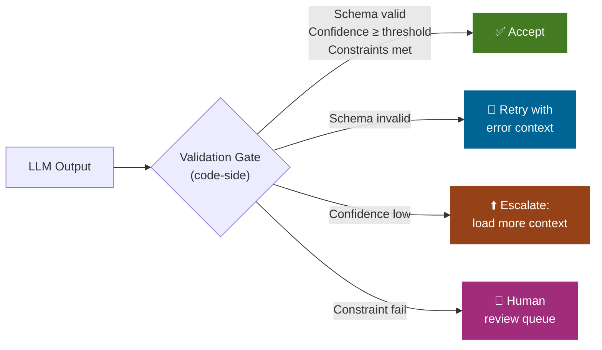

# Structured Output as a Validation Gate

*Vol 2 · Precision Agents*

---

## The Pattern

One of the most powerful and underused patterns in agentic AI is using **structured output** — asking the LLM to return a machine-parseable response — as the boundary between the AI's work and the code's validation. When the AI returns structured data, your code can apply deterministic quality checks before the result is accepted, escalated, or returned to the user.

This turns the LLM's output into a typed contract rather than a blob of text. When the contract is violated, your code knows immediately and can respond with targeted escalation rather than blind retry.

---

## The Validation Gate Pattern




The pattern is simple:

```
LLM call with structured output request
          ↓
   Code receives JSON / typed response
          ↓
   Code runs validation checks:
   • Schema correctness
   • Required field completeness
   • Logical consistency (e.g., date ranges don't overlap)
   • Confidence threshold gate
          ↓
   ┌─────────────────────────────────┐
   │ Pass: accept and return         │
   │ Fail: trigger targeted          │
   │       escalation to Pass 2      │
   └─────────────────────────────────┘
```

If the response passes validation, it's accepted and the pipeline ends. If it fails, the code triggers a targeted escalation: load additional context, add a specific correction instruction, or route to a more capable model. The escalation is informed — it knows *why* the previous pass failed.

Common validation checks and the escalation actions they trigger:

| Validation Check | What It Catches | Escalation Action |
|-----------------|----------------|------------------|
| Schema validation (required fields present) | Incomplete or malformed response | Retry with explicit field instructions |
| Confidence score below threshold | Low-certainty answer that might be wrong | Load additional context, second pass |
| Contradicts a known constraint | Factually inconsistent response | Load constraint-specific skill, retry |
| References an entity not in the input | Hallucination of source material | Expand context with actual sources |
| Response scope exceeds query scope | Over-generalization or drift | Tighten skill instructions, retry |

---

## Confidence Scoring

Confidence scoring gives the model a way to communicate uncertainty to your code. Instead of (or in addition to) the primary answer, ask the model to return a confidence score — either a numeric value (0.0 to 1.0) or a categorical label (high / medium / low) — alongside its response. Your code uses this score as a routing signal.

Corrective RAG (CRAG, arXiv:2401.15884) formalizes this pattern with a lightweight retrieval evaluator that assigns confidence scores to retrieved context, triggering corrective actions at three confidence levels. [Ref 3](../references.md#vol2-ref-3)

| Confidence Level | Action |
|-----------------|--------|
| **High** | Accept the response, return to the user |
| **Medium** | Load supplementary context, generate a second response, take the better of the two |
| **Low** | Escalate to the full domain library or a different retrieval strategy |

This pattern eliminates a class of failures that simple retry loops cannot catch: cases where the model returns a confident-sounding but incorrect answer because the initial context was plausible but incomplete. CRAG modules recover 2–3 F1 points over baseline RAG in production evaluations.

---

## Structured Outputs at Every Intermediate Step

The validation gate is most valuable when applied throughout the pipeline, not just at the final output. Ask the LLM to return JSON or a schema-defined response at every step:

- **Entity extraction:** return a typed `{entity_type, value, confidence}` array rather than prose
- **Intent classification:** return a typed `{intent, sub_intent, confidence}` object
- **Routing decisions:** return a typed `{matched_skill, confidence, alternatives}` object
- **Final response:** return the answer in the structured format appropriate for your downstream

Each structured intermediate output can be validated by code, catching failures early when they are cheapest to handle — before they propagate through subsequent steps.

---

## Don't Conflate Escalation with Retries

A retry sends the same prompt to the same model. An escalation sends a more specific prompt with additional context. They address fundamentally different problems:

| | Retry | Escalation |
|--|-------|-----------|
| **Fixes** | Transient failures (network timeouts, model glitches) | Structural failures (insufficient context) |
| **Mechanism** | Same input, hope for different output | Different input with targeted additional context |
| **Cost** | Low (same context size) | Higher (larger context, potentially stronger model) |
| **Failure signal** | None — no information about why it failed | Rich — validation tells you exactly what was missing |
| **Anti-pattern when** | Used to fix structural context gaps | Used for every failure regardless of root cause |

Using retries to fix structural failures produces inconsistent results and obscures the root cause. Build them as separate mechanisms with separate triggers.

---

## What Validation Cannot Do

Structured output validation is a powerful tool, but it has limits:

- It can validate **schema correctness** — required fields present, types match
- It can validate **logical consistency** — dates in range, referenced IDs exist
- It **cannot** validate **factual accuracy** — a perfectly structured JSON response can contain wrong facts
- It **cannot** validate **reasoning quality** — a well-formed answer can be the product of flawed reasoning

For factual accuracy and reasoning quality, validation is necessarily partial. Confidence scoring helps (the model can signal uncertainty), but it's not a complete solution. The accuracy flywheel in Chapter 6 addresses the ongoing measurement and improvement cycle that catches what validation alone misses.

---

## Dos and Don'ts

**Do treat the validation gate as the system's immune system.** It's not a nice-to-have. It's the mechanism that makes the flywheel turn. Without it, failures are invisible and untracked. Invest in this component early and make it comprehensive — it's the only way to turn failures into labeled data points.

**Do use structured outputs at every intermediate step.** Don't wait until the final response. Entity extraction, intent classification, confidence scoring — all of these benefit from structured output so code can validate each stage. Failures caught early are cheaper to fix than failures caught at the end.

**Don't conflate escalation with retries.** A retry sends the same prompt to the same model. An escalation sends a more specific prompt with additional context. Retries fix transient failures; escalations fix structural ones (insufficient context). Building retries to paper over structural failures produces inconsistent results and hides the root cause from your measurement system.

---

*→ Next: [Context Hygiene in Long-Running Loops](05-context-hygiene.md)*
*← Previous: [Progressive Context Loading](03-progressive-context-loading.md)*
