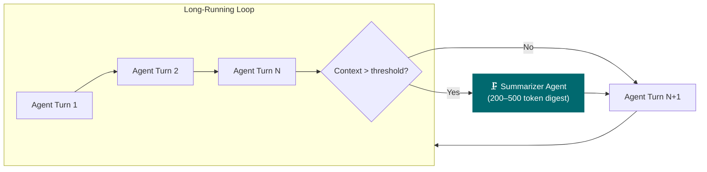

# Context Hygiene in Long-Running Loops

*Vol 2 · Precision Agents*

---

## The New Problem: Context Growth

The four principles covered so far address the architecture of a single invocation: how to load the right context, execute it cleanly, and validate the output. But agentic systems don't execute in a single step. They run across many turns, many subagent handoffs, and sometimes many hours. A distinct failure class emerges here: **context growth.** The system accumulates execution history faster than it discards it, and quality degrades long before any token limit is reached.

Context hygiene is the discipline of managing what gets forwarded at each handoff boundary — compressing what can be compressed, externalizing what cannot, and discarding what no longer serves the next agent in the chain.

---

## Two Failure Modes: Exhaustion vs. Drift

Most engineers are aware of **context exhaustion** — the hard limit where total input tokens exceed the model's context window. This failure is visible: the API errors, or the input is truncated. Teams build around it.

The more dangerous failure is **context drift** — a continuous, silent degradation in output quality that begins long before the context window is full. Research has established that frontier models lose accuracy continuously as context fills, with the degradation curve starting at token one, not as a cliff at the limit. [Ref 8](../references.md#vol2-ref-8)

Context drift was the dominant cause of multi-agent failure in enterprise production systems throughout 2025 — responsible for nearly 65% of failures, versus 35% caused by hard context exhaustion. [Ref 8](../references.md#vol2-ref-8)

```
Quality
  │
  │\
  │  \
  │    \──────────────────────────── ← context drift zone
  │                                  (silent, continuous)
  │                             \
  │                               \── context exhaustion cliff
  │                                   (visible error)
  └────────────────────────────────────────── Context size
      token 1                   window limit
```

A 400,000-token context is technically within window for current frontier models. The model will not error. But its reasoning quality may have already fallen substantially. The system appears functional; the outputs are subtly — then overtly — wrong.

---

## The Summarizer Agent Pattern




A Summarizer Agent is a dedicated component whose sole job is to compress execution history at each handoff boundary into a structured state object. It does not execute tasks. It distills them.

Formalized in ContextEvolve (arXiv:2602.02597, Feb 2026), the Summarizer Agent abstracts execution artifacts into natural-language summaries that preserve critical state information without carrying the full transcript. In the ContextEvolve three-agent framework, this compression step reduced token consumption by **29%** while improving task performance by **33.3%** over prior state-of-the-art methods. [Ref 9](../references.md#vol2-ref-9)

**The pattern in practice:**

1. After each subagent completes its work, the Summarizer Agent receives the full execution log
2. It produces a **typed structured state object**: what was decided, what was done, what the key outputs were, what remains open
3. The next subagent receives only this structured state — not the raw transcript
4. Typical structured states are 200–500 tokens; raw transcripts accumulate to 5,000–50,000+ tokens per turn

**The key constraint:** the structured state must be schema-defined, not prose. A typed object with named fields is machine-readable, validatable by your code, and composable across subagent boundaries. A prose summary loses the contract.

**Example state schema:**

```json
{
  "task_id": "billing-analysis-2026-06",
  "completed_steps": ["data_fetch", "deduplication", "classification"],
  "pending_steps": ["anomaly_detection", "report_generation"],
  "key_findings": ["3 duplicate invoices found", "revenue delta: +12.4%"],
  "artifacts": {
    "classified_data": "s3://pipeline/billing-2026-06/classified.parquet",
    "dedup_log": "s3://pipeline/billing-2026-06/dedup.log"
  },
  "open_questions": ["Invoice #4421 classification is ambiguous — needs human review"],
  "confidence": "high"
}
```

The receiving agent loads this state (500 tokens) rather than the raw 50,000-token execution transcript. It knows exactly what happened, what remains, and where the artifacts live — without carrying the work log.

---

## The Put-Away Pattern: Externalizing Non-Summarizable Artifacts

Not everything can be summarized. Generated code, structured data files, computation outputs — these are artifacts where the exact content matters and cannot be safely compressed into a natural-language abstract. Summarizing a 500-line Python script into two sentences loses information the next agent genuinely needs.

The correct pattern is **externalization**: write the artifact to storage (a file, a key-value store, a database), and pass a reference pointer in the structured state — not the content itself. The receiving agent loads the full artifact only if and when the structured state triggers it to act on it.

"Artifacts as Memory Beyond the Agent Boundary" (arXiv:2604.08756, April 2026) provides the theoretical grounding: when agents can observe environmental artifacts rather than carrying them in-context, the internal memory required to represent history is fundamentally reduced. The environment itself is memory. [Ref 11](../references.md#vol2-ref-11)

**Implementation patterns:**

| Artifact Type | Storage Approach | Pointer in State |
|--------------|-----------------|-----------------|
| Generated code | Write to file path | `"output_file": "/path/to/script.py"` |
| API response to retain | Write to temp store with key | `"cache_key": "api_response_xyz123"` |
| Multi-step computation output | Persist intermediate result | `"computation_id": "step3_result_a4f7"` |
| Database query results | Write to CSV/Parquet | `"data_file": "s3://bucket/query_result.parquet"` |

The receiving agent loads the full artifact only when the structured state explicitly triggers it — not by default. This keeps the handoff context compact regardless of artifact size.

---

## The Lifecycle at Each Handoff

At each handoff boundary, three actions are available:

| Content Type | Action | Why |
|-------------|--------|-----|
| Decisions, reasoning, and intent | **Summarize** (200–500 tokens) | Next agent needs alignment, not the full transcript |
| Generated artifacts (code, data files) | **Externalize** + pass reference pointer | Full content required; lossy compression is harmful |
| Intermediate scaffolding and scratch work | **Discard** | No longer serves the next agent |
| Error patterns and corrections | **Summarize selectively** | Patterns matter; specific error messages usually do not |
| Session-critical invariants (user ID, task goal) | **Pass in full** (keep short) | Cannot afford any compression loss on these |

**The decision rule:** does the next agent need to know this (summarize), need to act on the full content of it (externalize), or neither (discard)?

> **The Rule:** At every subagent boundary: summarize decisions into structured state, externalize artifacts to storage with reference pointers, discard scaffolding. The next agent should receive the minimum context needed to continue the work — not the full history of how you got there.

Most intermediate scaffolding — exploratory attempts, debug logs, interim reasoning — falls into the discard bucket. It was useful for producing the current state; it is dead weight for the next step.

---

## The Counterintuitive Result

More tokens does not mean better reasoning. Often it means worse.

Every additional token in the context is a potential distractor — information the model must de-weight or ignore rather than reason over. A well-constructed 8,000-token context with structured, current state outperforms a 400,000-token context of accumulated execution history on every dimension: accuracy, latency, and cost.

E-mem (arXiv:2601.21714, Jan 2026) demonstrates this at scale: a hierarchical architecture that keeps per-episode contexts uncompressed but strictly bounded outperforms flat context accumulation by **7.75% F1** while reducing token cost by over **70%**. [Ref 10](../references.md#vol2-ref-10) The signal emerges precisely because the noise is eliminated.

> **Context hygiene is not about losing information. It is about forwarding only the information that still serves the next agent. Everything else is dead weight that forces the model to work harder to find the signal.**

---

## A Real-World Failure Story

> **Real-World Observation:** A multi-agent loop began producing increasingly incoherent outputs after approximately 15 minutes of operation. Every subagent received the full execution history at each turn. By turn 20, the context payload had reached 400,000 tokens — the model was within its window, but quality had collapsed. The fix: a Summarizer Agent at each handoff, compressing execution logs into a 500-token structured state object. Context per call dropped from 400k to under 8k tokens. Quality recovered immediately. The counterintuitive result: the system became *more focused*, not less, with less context. This is the mechanism, not an accident.

---

## Dos and Don'ts

**Don't forward raw execution history to the next subagent.** By turn 20, a full transcript is 400,000 tokens. Distill at every handoff: 200–500 token typed state object, externalized artifacts with reference pointers, scaffolding discarded. The next agent needs the minimum context to continue the work — not the complete record of how you got there. Context drift begins at token one.

**Do decide at every handoff: summarize, externalize, or discard.** Nothing else. Decisions and intent → summarize. Generated artifacts (code, data files) → externalize to storage, pass the reference pointer. Intermediate scaffolding and scratch work → discard. Applying this discipline consistently is what keeps long-running loops functional past turn 5.

**Don't treat context hygiene as a future optimization.** Context drift is a continuous process that begins at token one and was the dominant cause of multi-agent failure in 2025. By the time you notice quality degradation, you are already well past the point where it started. Build the Summarizer Agent pattern from the start.

---

*→ Next: [The Accuracy Flywheel](06-accuracy-flywheel.md)*
*← Previous: [Structured Output as a Validation Gate](04-validation-loops.md)*
