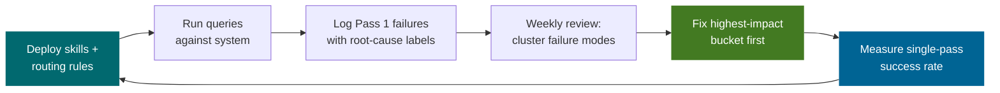

# The Accuracy Flywheel

*Vol 2 · Precision Agents*

---

## What the Flywheel Is




The accuracy flywheel is the operational loop that converts system observations into targeted improvements. It is what separates a system that gets lucky from a system that gets better. Without it, the architecture described in the previous chapters is static — it works as well as you built it and no better. With it, the system systematically improves over time, turning each failure into a labeled data point that drives a specific fix.

The flywheel has four phases: **measure, identify, fix, re-measure.**

```
        ┌─────────────────────────────────────────────────────────┐
        │                                                         │
    Measure                                                   Re-measure
  single-pass                                              verify improvement
  success rate    ────────────────────────────────────────►    same sample
        │                                                         │
        │                                                         │
        ▼                                                         ▲
    Identify                                                    Fix
  root-cause each                                          update routing rules,
  Pass 2+ failure:                                         refine skill content,
  routing miss?                ◄─────────────────────    add validation gate
  skill gap?
  model limit?
```

---

## The Primary Metric: Single-Pass Success Rate

The most important metric in a progressive context architecture is the **single-pass success rate**: what percentage of queries are answered correctly on Pass 1, without triggering escalation.

This metric combines:
- **Routing accuracy** — did the right skills load?
- **Skill quality** — was the content precise enough?
- **Model capability** — could the model use the context correctly?

Track this metric per query category, per skill, and over time. A declining single-pass rate for a specific category tells you that something in that category's routing or skill content has drifted. An improving rate after a change tells you the change worked.

**Why single-pass rate matters:**

At 80% single-pass, 20% of queries require additional LLM calls, additional latency, and additional token spend. At 95%, that drops to 5%. The improvement is not just financial — a single-pass answer is also faster and simpler, with less accumulated context across multiple passes.

---

## Setting and Evolving Targets

Set an initial target based on your system's current state. A new system might start at **60% Pass 1 success** and improve over time — the architecture is working if that number moves upward consistently. A reasonable benchmark for a system with well-written skills and clean context management is **80% single-pass success**. From there, raise the target as the system matures: once you consistently hit 80%, aim for 85%, then 90%, then 95%+.

| Phase | Target | How to Get There |
|-------|--------|-----------------|
| Initial | 80% | Keyword routing + well-scoped skills |
| Improving | 85% | Refine routing rules from observed misses |
| Optimizing | 90% | Improve skill content for high-miss categories |
| Mature | 95%+ | Fine-tune validation thresholds; split overlapping skills |

The target is not arbitrary. Track it, make it visible to the team, and review it weekly.

---

## Root-Cause Labels Are the Raw Material

When a query fails Pass 1 and escalates, log not just the fact of escalation but **why**:

| Root Cause Label | What It Means | What to Fix |
|-----------------|--------------|-------------|
| `routing_miss` | The right skill was not loaded | Update routing rules; add keywords or improve embeddings |
| `skill_gap` | Skill loaded but content was insufficient | Refine skill instructions; add reference files |
| `model_failure` | Skill was adequate but model got it wrong | Consider stronger model for this category; review skill clarity |
| `ambiguous_tool` | Multiple tools matched; wrong one selected | Clarify tool descriptions; split tools with overlapping scope |
| `context_drift` | Long session; accumulated context degraded quality | Add Summarizer Agent; review compaction boundaries |

Without these labels, you're improving blindly. With them, every failure is a work order.

---

## The Flywheel in Practice

The flywheel works because each component is independently measurable and independently improvable:

- **Routing accuracy** can be measured with a labeled test set of queries and expected skill matches
- **Skill quality** can be measured by the pass rate for queries routed to a given skill
- **Validation gate precision** can be measured by the false-positive and false-negative rates of the confidence threshold
- **Context drift contribution** can be measured by comparing single-pass rate for early-session vs. late-session queries in long runs

**This separability is by design.** In a monolithic mega-prompt system, a quality improvement on one workflow might degrade another — you can't change one part without risking the whole. In a modular system with progressive context loading, changes are local: updating the crankshaft skill doesn't touch the engine management skill. Each change has a measurable, isolated effect.

---

## The Flywheel Turning Schedule

Teams that make single-pass success a first-class metric consistently improve it. Teams that only monitor final output quality often have invisible routing and escalation inefficiencies that inflate cost and latency without showing up in quality scores.

**Suggested operating cadence:**

| Frequency | Activity |
|-----------|---------|
| Real-time | Log every escalation with root-cause label |
| Daily | Review escalation volume by category |
| Weekly | Analyze root-cause distribution; identify top fix opportunities |
| Per sprint | Ship skill updates, routing rule changes; re-measure |
| Monthly | Review target thresholds; raise if consistently met |

The flywheel turns slowly at first, then faster. The first few months of measurement establish baselines and surface the highest-impact fixes. By month 3–6, a well-instrumented system is seeing consistent week-over-week improvement.

---

## Dos and Don'ts

**Do set aggressive single-pass targets and measure weekly.** An 80% single-pass target sounds high until you measure your current system. Set the target, make it visible, and review it weekly. Teams that make single-pass success a first-class metric consistently improve it; teams that only monitor final output quality have invisible routing and escalation inefficiencies inflating cost and latency without showing up in quality scores.

**Do log every escalation with a root-cause label.** Not just that it escalated — why. Routing miss? Skill gap? Model failure? Context drift? These labels are the raw material of the flywheel. Without them, you are improving blindly; the measurement loop produces no actionable signal.

**Don't skip measurement because the system seems to be working.** A system that "seems to be working" has an unknown single-pass success rate. Without measurement, you don't know whether you're handling 80% of queries on the first pass or 40%. The flywheel does not turn without data. Instrument from the start.

---

*→ Next: [Writing Precision Skills & Reference Architecture](07-precision-skills-and-architecture.md)*
*← Previous: [Context Hygiene in Long-Running Loops](05-context-hygiene.md)*
