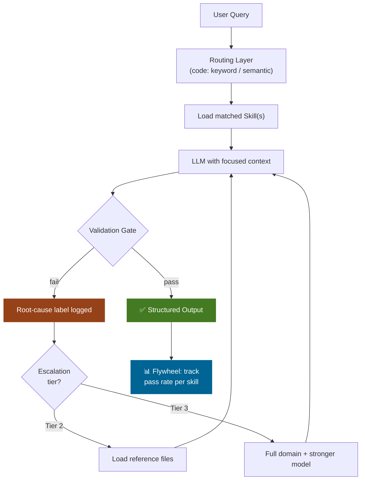

# Writing Precision Skills & Reference Architecture

*Vol 2 · Precision Agents*

---

## Why Skill Quality Is the Flywheel's Bottleneck

The quality of the accuracy flywheel is bounded by the quality of the skills it loads. A well-designed routing system that loads a poorly written skill will still fail. Precision skills are not about thoroughness — they are about clarity, scope, and non-ambiguity.

A skill that fires on 60% of relevant queries is not a skill — it is an occasional hint. The target is **90%+ activation accuracy**: the skill should trigger automatically for 9 out of 10 queries that genuinely need it, without being manually invoked. [Ref 1](../references.md#vol2-ref-1) Test this with a labeled set of representative prompts before deploying a skill to production.

---

## Structural Rules for Precision Skills

**One skill, one domain.** A skill covering both "billing inquiries" and "technical troubleshooting" is two skills that need to be split. When the billing sub-domain activates this skill for a billing query, the troubleshooting instructions are irrelevant context that consumes tokens and creates potential for confusion.

**Front-load the trigger signal.** The first sentence of the description should state precisely when this skill applies — and when it does not.

**Use positive and negative examples.** *"Use this when the user asks about X; do not use this when the user asks about Y."* Both matter. The negative examples are often more discriminative than the positive ones.

**Avoid conditional logic.** `if X then do Y else do Z` belongs in a local tool, not a `SKILL.md` file. Skills describe how to approach a problem; tools implement the branching logic.

**Keep instructions under 5,000 tokens.** Anything longer should be split across multiple skills or moved to reference files linked from the skill.

**Reference files by name, not by content.** If a skill needs detailed technical material, link to a reference file that is loaded on demand — do not embed it inline.

---

## The Ambiguity Test

Before deploying a skill, apply the ambiguity test: read the instructions aloud and ask: *"if someone followed these instructions literally, with no additional context, would they get the right answer 90% of the time?"*

If the answer is "it depends" or "they would need to know X first," the skill needs to be more precise or the dependency needs to be declared as a reference file the skill explicitly loads.

---

## Precision vs. Coverage

There is a natural tension between **precision** (narrow, unambiguous, high-confidence activation) and **coverage** (handling a wide range of query variations). The correct resolution:

> **Prefer precision and use the progressive context model for coverage.** A narrow skill that fires reliably on the core case, with reference files and escalation to broader context for the edge cases.

A skill that tries to cover every variation of a domain becomes a mini-mega-prompt with the same problems as the original. Ten precise skills that each cover a distinct sub-domain are more accurate, cheaper to run, and easier to improve than one broad skill that covers all ten.

---

## Reference Architecture: The Full Query Lifecycle

The following integrates all five principles into a cohesive system design for a local AI package. Only the Execution layer invokes the language model; all other layers are deterministic code.

| Layer | Component | Technology | Principles Applied |
|-------|-----------|------------|-------------------|
| **Input** | Query ingestion + pre-processing | Code | Code-first: clean, tokenize, extract signals in code |
| **Routing** | Keyword matcher / semantic router | Code or embedding model | Code-first + modular: deterministic routing, no LLM |
| **Context** | Skill registry + progressive loader | Code (file-based) | Progressive loading: metadata first, instructions on match |
| **Execution** | Focused subagent(s) with loaded skills | LLM + tools | Modular: each subagent has narrow, focused context |
| **Validation** | Structured output parser + confidence gate | Code | Code-first: deterministic quality checks |
| **Escalation** | Progressive context expansion + retry | Code + LLM | Progressive: expand context only on validated failure |
| **Measurement** | Pass rate tracker + routing accuracy log | Code | Flywheel: every run contributes to improvement data |

**The full query flow** (only steps marked `[LLM]` invoke the language model):

1. Ingestion: receive query, extract metadata — `[Code]`
2. Signal extraction: identify domain keywords, entity names, command patterns — `[Code]`
3. Routing: match signals to skill subset using keyword rules or semantic similarity — `[Code]`
4. Context assembly: load skill metadata (always), activate matched skill instructions — `[Code]`
5. Generation: invoke LLM with assembled context, request structured output — `[LLM]`
6. Validation: parse structured output, run schema checks and confidence gate — `[Code]`
7. Decision: if passes validation, return response; if fails, identify failure type — `[Code]`
8. Escalation (if needed): load targeted additional context, retry from step 5 — `[Code + LLM]`
9. Measurement: log pass/fail, which pass succeeded, which skill was loaded — `[Code]`

---

## How the Architecture Matures Over Time

A new system starts simple: keyword routing, one skill per major domain, a basic confidence threshold. Over time, as the flywheel runs, specific components evolve based on measurement data:

| Component | Evolution Path |
|-----------|---------------|
| Routing rules | More precise as you observe which keywords are most predictive |
| Skills | Tighter scope, clearer instructions, better reference files for those with low pass rates |
| Confidence threshold | Tuned based on observed correlation between scores and actual answer quality |
| Subagent boundaries | High-volume categories may get dedicated subagents with even more focused context |
| Reference files | Grow as the system encounters edge cases that need depth without burdening default context |

The architecture is designed to accommodate this evolution. Changes are local. Improvements are measurable. The system gets better without being rebuilt.

---

## Dos and Don'ts

**Do version your skills alongside your code.** Skills are behavioral code. A change to a skill can break a workflow just as surely as a change to a function. Use version control, deploy changes through the same review process as code, and test activation accuracy before and after every change.

**Do test skill activation accuracy before shipping.** Target 90%+ activation: the skill should trigger for 9 out of 10 queries that genuinely need it. Use a labeled set of representative prompts. A skill that fires 60% of the time is an occasional hint, not a reliable behavioral guide.

**Don't load full domain libraries on Pass 1 to avoid writing reference files.** Reference files loaded on demand are the right answer for deep technical material. Embedding everything inline inflates every invocation of the skill, even when the detail isn't needed. Keep skill instructions behavioral and under 5,000 tokens; link to reference files for depth.

---

*→ Next: [Principles Working Together](08-principles-working-together.md)*
*← Previous: [The Accuracy Flywheel](06-accuracy-flywheel.md)*
