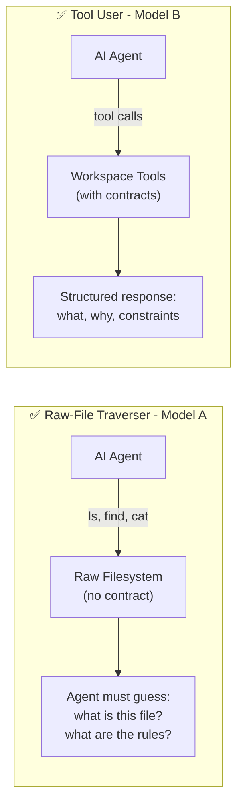

# The Core Problem: Two Mental Models

*Vol 3 · Workspace Contracts*

---

## The Design Decision That Changes Everything

When an AI agent is deployed into a workspace — a directory of files, data sources, and configuration — how it accesses that workspace is a design decision with large downstream consequences. Two fundamentally different models exist, and the wrong choice for a given domain produces systems that are either stale, brittle, or both.

---

## Model A: AI as Raw-File Traverser

In Model A, the agent explores folders, reads files it finds, and reasons over their contents. The agent needs in-context guidance about what each folder is for, because nothing else provides that context. **Per-folder context files** are the natural mechanism: placed where the agent traverses, read locally when needed.

This is the lineage of the per-folder `CLAUDE.md` convention used by claude-mem.ai, the `AGENTS.md` ecosystem broadly, and the Vercel Next.js docs-index pattern. The agent's interface to the workspace is file reads. Policy, semantics, and guidance all live in the files themselves.

**When Model A works:**
- The workspace has stable, fixed folder semantics (the folders don't change, their purpose doesn't change)
- Files within folders are long-lived artifacts that the agent needs to read and reason over
- The cost of maintaining per-folder context files is low relative to the benefit they provide
- The workspace is a codebase or documentation set, not a dynamic pipeline output

> **When Model A fits:** Model A works best where folder semantics are stable: a software codebase that an engineer is exploring, where each folder has a fixed, well-understood role, and a stamped documentation file can match reality for a long time without becoming stale. The maintenance cost of keeping files current is low because what gets stamped is durable.

**When Model A breaks:**
- Files change on every run — yesterday's per-folder README describes a workspace that no longer exists
- Policy encoded in stamped files drifts from the actual runtime behavior of the system
- There are many workspaces (e.g., one per customer, one per pipeline run) and keeping N copies of the same policy in sync is operationally expensive

---

## Model B: AI as Tool User

In Model B, the agent calls tools — a consuming library, CLI commands, or structured APIs — that already know the workspace contract. Tools select the right files based on criteria, return filtered output, and enforce policy deterministically. The contract lives in code; the agent never reads it directly.

The agent's interface to the workspace is function calls, not raw file traversal. This shifts the guarantee from probabilistic (the agent reads a README and *chooses* to follow it) to deterministic (the code enforces the contract on every call, regardless of what the agent decides).

**The guarantee difference is architectural:**

```
Model A: Agent reads README → Agent decides to comply → Sometimes correct
Model B: Agent calls tool → Tool enforces contract → Always correct (for the enforced rules)
```

**When Model B works:**
- The workspace is dynamic — files are produced by pipeline runs and change constantly
- Multiple workspaces share the same policy, and policy needs to update everywhere simultaneously
- Credential isolation, contamination prevention, or data integrity are hard requirements
- Many agents (or many instances of the same agent) operate on the same workspaces

> **When Model B fits:** Model B works best where the workspace is dynamic: content changes on every run, "the latest file" shifts per operation, and the contract itself (file naming patterns, producers, retention rules) evolves with the toolset. Stamped per-folder content under these conditions is stale within a few turns. The maintenance gap between source and stamped copy is small for a stable codebase and large for an evolving run-based workspace.

**When Model B requires investment:**
- You have to build the tools — a workspace library (the consuming library that enforces naming conventions and write-time policy), a `describe` local tool (a CLI command that reads the contract source and returns current folder semantics on demand), and an audit tool that detects drift at check-time. These are fully described in [Chapter 5](05-reference-architecture.md); this paper uses `wslib`, `describe-tool`, and `doctor-tool` as names for the reference implementation of each.
- The contract source — a single YAML file (`skel.yaml` in this paper's reference implementation) that declares file patterns, producers, and naming rules — must be kept current. This is the one file that describes the workspace contract. The workspace library reads it; the describe tool surfaces it; individual workspace folders never receive a copy of it. One file to update means one place to drift.
- Discovery requires the agent to know the surfacing tool exists (see [Chapter 5](05-reference-architecture.md))
- Not worth it for a simple, stable, single-agent codebase

---

## The Choice Is About Domain Fit

Model A is not wrong as a category. It is the right choice for stable codebases with fixed folder semantics. The failure mode of Model A in a dynamic workspace is context that was accurate at initialization and stale within two turns. The failure mode of Model B in a simple codebase is unnecessary engineering investment.

**The question to answer:** does your workspace have stable or dynamic semantics?

| Workspace Type | Right Model | Why |
|---------------|------------|-----|
| Codebase with fixed structure | A | Folder semantics don't change; per-folder context files stay accurate |
| Documentation set | A | Content is human-authored and evolves deliberately |
| Dynamic pipeline output | B | Files change on every run; stamped context is always stale |
| Multi-tenant SaaS workspace | B | Policy must update everywhere simultaneously; tools enforce it |
| Hybrid (stable + dynamic areas) | A for stable, B for dynamic | With explicit boundaries between the two |

### The hybrid case deserves more than a table row

Most real production systems are not cleanly Model A or Model B — they are hybrids. A codebase has a stable folder structure (Model A territory) but also a `/tmp/` or `/outputs/` area that changes on every run (Model B territory). A data pipeline has a fixed schema contract (stamp it in a STEERING.md once) but dynamic per-run output files (surface them via a `describe-tool` instead).

The binary framing is useful for teaching the distinction, but **the real engineering difficulty lives at the boundary**: deciding which parts of a workspace are stable enough for stamped context files and which parts are too dynamic. Getting this wrong in either direction has costs:

- Apply Model A to a dynamic area → stale context that silently misleads the agent about what files actually exist.
- Apply Model B to a stable area → unnecessary engineering investment, tools built for contract enforcement where a one-time README would have been accurate for years.

**A practical boundary rule:** if the content a context file would contain could become wrong within a single sprint without anyone deliberately changing it, it belongs in Model B. If it describes durable structure that only changes when a human makes a conscious architectural decision, Model A is appropriate.

In the hybrid case, the architecture looks like this:

- One minimal `STEERING.md` at the workspace root (Model A) — points to stable conventions, lists the tools available, and explicitly names which areas are tool-surfaced.
- Per-folder context files only in the stable areas (Model A) — codebase structure, module roles, fixed schema definitions.
- A `describe-tool` (Model B) for the dynamic areas — surfaces current state on demand, never stamped.

The boundary between the two should be explicit in the root steering file, not implicit. An agent that doesn't know which areas are dynamic will try to read them as if they were stable.

The next chapter covers the four tenets that operationalize Model B as an architectural direction. If your domain is clearly Model A, [Chapter 3](03-evidence-and-tradeoffs.md) covers the empirical evidence that still applies to your steering file and context file design.

---

## A Concrete Example




Consider a customer data pipeline workspace with this structure:

```
/customers/acme-corp/
├── /metrics/          ← outputs from scoring engine
├── /enriched/         ← outputs from enrichment tool
├── /logs/             ← pipeline execution logs
├── /raw/              ← customer-uploaded CRM exports
└── README.md          ← 5-line pointer file (never changes)
```

After three pipeline runs, the workspace contains:
- `/metrics/health_score-20260527-2215-a3f7.json`
- `/metrics/engagement-20260528-0900-b1d2.json`
- `/enriched/contacts-20260527-2215-a3f7.parquet`
- `/enriched/accounts-20260528-0900-b1d2.parquet`
- `/logs/pipeline-20260527-2215-a3f7.log`
- `/raw/crm_export-20260527.csv`

> **The workspace directory example — policy vs. state:** A `/customers/acme-corp/` workspace after three pipeline runs: `/metrics/health_score-20260527-2215-a3f7.json`, `/metrics/engagement-20260528-0900-b1d2.json`, `/enriched/contacts-20260527-2215-a3f7.parquet`, `/enriched/accounts-20260528-0900-b1d2.parquet`, `/logs/pipeline-20260527-2215-a3f7.log`, `/raw/crm_export-20260527.csv`, `README.md`. The RUNID (`a3f7`, `b1d2`) is an 8-character hex that ties every output from the same pipeline run together — a traceability key that belongs in `wslib`. **Policy** (same for every customer, belongs in `wslib` code): the naming pattern `{metric_type}-{YYYYMMDD}-{HHMM}-{RUNID}.{ext}`; the rule that `/metrics/` only accepts outputs from the scoring engine; the RUNID format and generation logic. **State** (varies per customer per run, belongs in the workspace): which specific files are present, which run IDs correspond to which dates. **What goes wrong:** a per-folder STEERING.md in `/metrics/` that reads "This folder contains health_score and engagement metrics." That is `wslib` policy, stamped as a file. When the scoring engine adds a third metric type in a later release, every customer workspace carries a STEERING.md that is wrong — silently, in every workspace, until an agent acts on the stale guidance.

**Model A would stamp** a README in each subfolder explaining what goes there — and that README would be accurate when written and stale immediately, because the files it describes change on every pipeline run.

**Model B would have** a `describe-tool metrics/` command that dynamically returns the current state of the `/metrics/` folder, what file patterns are valid, and which runs have produced output. The description is always current because it reads the actual filesystem.

The `RUNID` (`a3f7`, `b1d2`) — the 8-character hex that ties all outputs from a single pipeline run together — is a policy concept. **In Model B, it belongs in the `wslib` code, not in a per-folder README.** The code enforces the naming convention on every write; the agent doesn't need to know the convention exists.

---

## Dos and Don'ts

**Do answer the domain question before any other decision.** Is this workspace stable or dynamic? That single answer determines the right model before any other architectural choice — what goes in the steering file, whether to build a surfacing tool, how to handle discoverability. Getting this wrong means everything downstream is wrong.

**Don't apply Model A to a workspace where files change on every run.** Per-folder context files describe a workspace that exists at a moment in time. In a dynamic pipeline workspace, that moment expires within a few turns. A STEERING.md in `/metrics/` that accurately described the folder on day one is wrong the day a new metric type ships — silently wrong, in every workspace.

---

*→ Next: [The Four Architectural Tenets](02-four-tenets.md)*
*← [Back to Vol 3 Overview](00-overview.md)*
