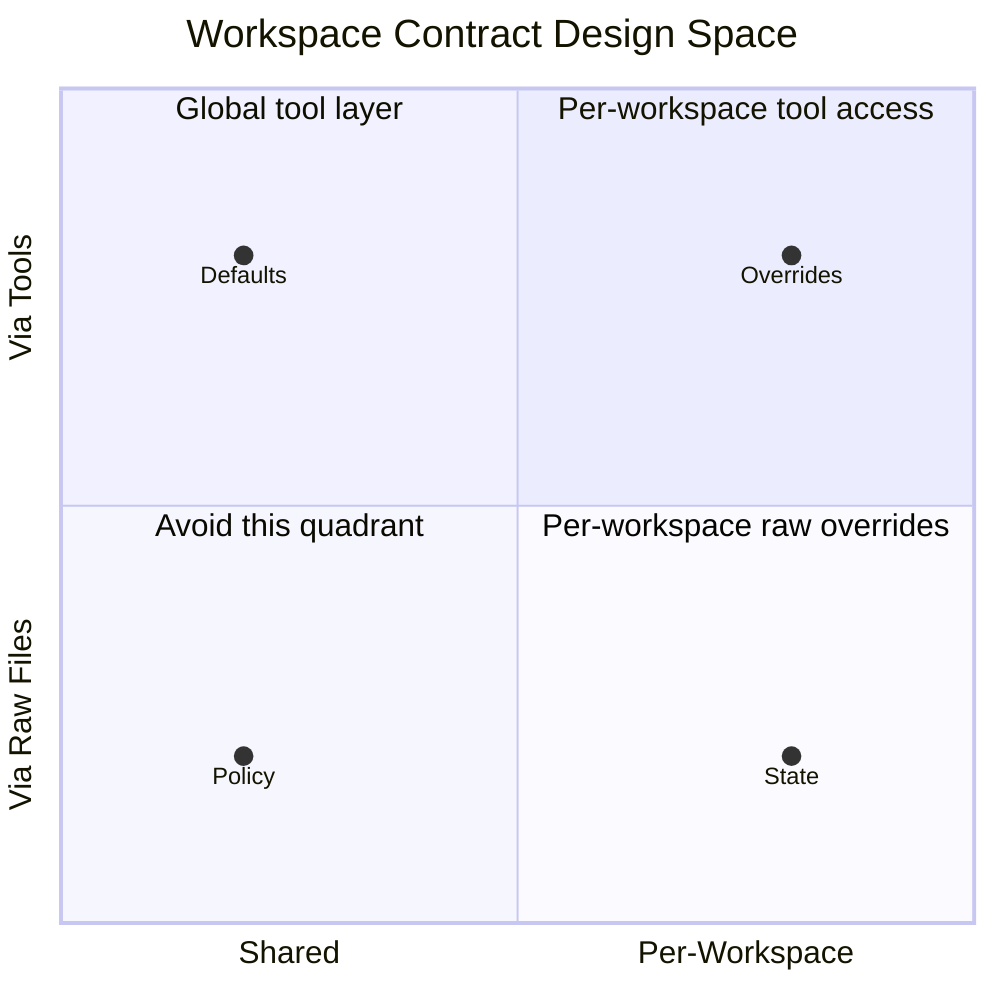

# The Four Architectural Tenets




*Vol 3 · Workspace Contracts*

---

These tenets operationalize Model B as an architectural direction. They are commitments, not recommendations — if you disagree with a tenet, the trade-offs in the next chapter will land differently for you.

---

## Tenet 1: Policy in Code, State in the Workspace, Contract Through Tools

A workspace contract has two parts: **policy** (rules that tools should enforce) and **state** (data files produced by runs). These belong in different places.

**Policy belongs in code**, declared once in a single source the consuming library reads, and surfaced on demand through tools (CLI commands, describe-tool, the webserver). Stamping policy into every workspace folder duplicates content that doesn't vary across workspaces, and gives the contract surface area to drift from the source. A tool-surfaced contract is fetched fresh on every call. A stamped file is a snapshot of the contract at the time it was written.

**State belongs in the workspace** as the output of each run.

The distinction:
- **Policy examples:** which file patterns are valid in each directory, retention rules, naming conventions, contamination checks — *what the workspace should look like*
- **State examples:** the specific files currently in `/metrics/`, `/enriched/`, `/logs/` — which run IDs are present, which date ranges are covered — *what the workspace actually contains*

```
Policy → lives in workspace library code → surfaced by tools → agent reads it on demand
State  → lives in workspace   → produced by runs  → agent reads it directly
```

---

## Tenet 2: Defaults Are Shared; Overrides Are Per-Workspace

Defaults apply to every workspace and do not need to live in any one of them. Stamping a default into every workspace duplicates content that is identical everywhere, creating many copies of a single source of truth that can drift independently.

**Overrides** — per-workspace context, experimental playbooks, customer-specific quirks — belong in the workspace because they vary per workspace.

> **The test:** if it's the same in every workspace, it belongs in the shared library or defaults configuration. If it differs by workspace, it belongs in the workspace.

A common failure mode: copying a "default config" into every workspace folder because it was faster than setting up a shared defaults mechanism. Six months later, the default changes. Now you have N workspaces with the old default and M with the new one, with no clear source of truth.

---

## Tenet 3: AI Consumes Through Tools, Not Raw Files

AI agents access the workspace via the same library and CLI tools that humans use, receiving filtered output based on the contract. The system is not designed for AI as a raw-file traverser that reads everything in `*` and reasons over it; it is designed for AI as a tool user where the contract is enforced deterministically by code.

This is the same principle from Vol 2 of this series: what stays in code, we do in code. A write-time check inside `wslib.write()` that refuses to place flow logs in `/metrics/` is a **hard check**, enforced on every write regardless of what the agent decides. A per-folder README saying "do not put flow logs here" is a **soft check** that depends on the agent reading it and choosing to comply on every traversal.

Research bounds this concretely. Gloaguen et al. (arXiv:2602.11988) found that LLM-generated context files reduce task success by 0.5–2% and increase inference cost by 20–23%. [Ref 1](../references.md#vol3-ref-1) The soft check not only fails to help — it actively costs performance. The hard check in code has zero runtime token cost and deterministic enforcement.

---

## Tenet 4: Heal Forward

When the source of truth and on-disk reality drift, tools detect and report it. Failure modes are explicit:
- A missing source falls back to a code-defined default
- An unparseable source raises loudly
- On-disk drift (files that shouldn't exist, orphaned output from old runs) is reported as an orphan or recreated idempotently

**Heal-forward** means the system has an explicit answer to every failure mode. It doesn't silently ignore drift or leave it to the agent to notice and correct. The agent's job is to do work, not to audit the workspace contract. Auditing is the code's job.

This tenet is most important in long-running pipelines with many independent runs. Without heal-forward, orphaned files from failed runs accumulate, the workspace becomes ambiguous, and agents start reasoning over state that no longer reflects what the pipeline actually produced.

---

## The Tenets as a Coherent System

The four tenets form a coherent system:

```
Tenet 1: Policy lives in code → surfaced through tools
Tenet 2: Defaults are shared → overrides are local
Tenet 3: AI reads through tools → not raw file traversal
Tenet 4: Drift is detected and healed → not silently ignored
```

Together they define a workspace architecture where the contract is always live, always current, and always enforced — regardless of how many agents operate on the workspace, how many pipeline runs have produced state, or how long the workspace has been running.

---

## Dos and Don'ts

**Do put policy in code, not in files the agent reads.** File naming conventions, retention rules, contamination checks belong in `wslib`, enforced at write-time. A write-time guard is a hard check that fires on every write regardless of agent behavior. A per-folder README warning is a soft check that depends on the agent reading it and choosing to comply. For safety-critical policy, only hard checks are sufficient.

**Don't stamp policy into every workspace.** Per-folder files describing the contract create maintenance debt: each new tool or policy change requires finding and updating every relevant file. Without automated enforcement, drift is inevitable. The same information stamped into 15 workspaces is 15 copies of a single source of truth, each accumulating independent inaccuracies over time.

**Do build doctor-tool alongside the workspace library.** Write-time guards catch most contamination, but not everything. Audit-time checks catch what slipped through, detect orphaned files from old runs, and make drift explicit rather than silent. Both enforcement layers are needed; neither alone is sufficient.

---

*→ Next: [The Empirical Evidence & Tradeoffs](03-evidence-and-tradeoffs.md)*
*← Previous: [The Core Problem: Two Mental Models](01-two-mental-models.md)*
