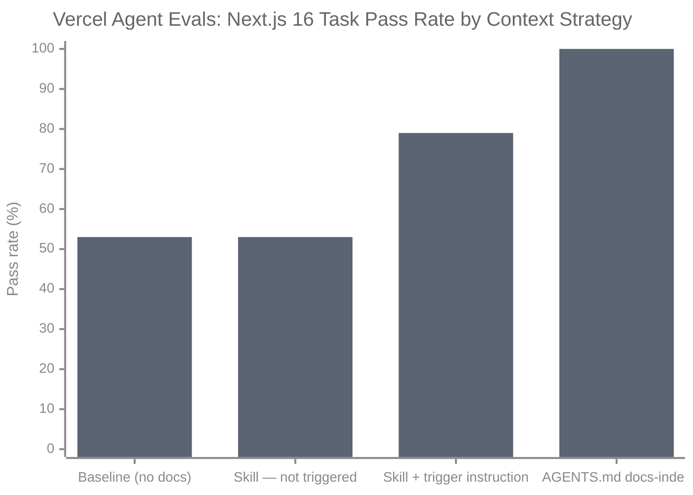

# The Empirical Evidence & Tradeoffs

*Vol 3 · Workspace Contracts*

---

## Three Independent 2026 Studies

The Model A / Model B distinction is not purely architectural — there is now direct empirical evidence about when each approach works. Three independent 2026 studies are particularly relevant.

---

### Study 1: Gloaguen et al. — "Evaluating AGENTS.md" (arXiv:2602.11988)

The most rigorous evaluation of repository-level context files to date. Tested `CLAUDE.md` and `AGENTS.md` files across 300+ coding tasks using multiple frontier models (Claude Code Sonnet-4.5, GPT-5.2, Qwen3-30b-coder) on two benchmarks: SWE-bench Lite (popular repositories) and AGENTbench (niche repositories with developer-written context files). [Ref 1](../references.md#vol3-ref-1)

**Key findings:**

| Configuration | Task Success Change | Inference Cost Change |
|--------------|-------------------|----------------------|
| LLM-generated context files | −0.5% to −2% average | +20% to +23% |
| Human-written context files | +4% average (inconsistent) | +19% |
| No context files (baseline) | Baseline | Baseline |

**The critical nuance:** context files help when documentation is otherwise absent. They "not only consistently improve performance by 2.7% on average, but also outperform developer-written documentation" when the repository has no existing docs. The harm comes from redundancy: when model training data already covers the domain, context files add token cost without adding information.

This explains anecdotal success reports — they come from niche or underdocumented domains, not from popular, well-documented ones.

**Recommendation from the paper:** *"describe only minimal requirements"* and *"omit LLM-generated context files."* Context files should contain tooling-specific instructions that cannot be inferred from the codebase — not general documentation.

---

### Study 2: Vercel Engineering — "AGENTS.md Outperforms Skills" (Jan 2026)

Vercel's engineering team tested four configurations for providing agents with Next.js 16 API knowledge. [Ref 2](../references.md#vol3-ref-2)

| Configuration | Pass Rate | vs Baseline |
|--------------|----------|-------------|
| Baseline (no docs) | 53% | — |
| Skill (default, no instructions) | 53% | +0pp — no improvement |
| Skill with explicit AGENTS.md trigger | 79% | +26pp |
| AGENTS.md compressed docs-index (8KB) | **100%** | +47pp |

**The winning configuration** was not full documentation in `AGENTS.md` — it was a compressed 8KB index *pointing* the agent to specific doc files. The mechanism, in Vercel's words: *"no decision point."* Skills require the agent to decide to invoke them; they were not triggered 56% of the time without explicit instructions. Passive context in `AGENTS.md` is available on every turn without an invocation decision.

**Important scope note:** this was tested on a framework-specific coding task, not a dynamic run-based workspace. The Vercel finding validates the anchor-and-skill pattern for *stable knowledge domains*, not for Model B dynamic workspace scenarios.

---

### Study 3: claude-mem.ai — Automated Per-Folder CLAUDE.md

The claude-mem.ai tool implements Model A at scale: it auto-generates `CLAUDE.md` files in project folders with a "Recent Activity" timeline — observation IDs, timestamps, activity types, and brief titles. This gives the agent a rolling history of what has been done in each folder. [Ref 3](../references.md#vol3-ref-3)

Their implementation acknowledges the domain-fit constraint explicitly:
- The feature is **disabled by default**
- The project root is excluded (to avoid overwriting manually curated instructions)
- The documentation frames it as *"for developers working on stable codebases, wanting to know what each directory does"*

The stamped format (auto-generated inside `<claude-mem-context>` tags, preserving user-written content outside them) is a practical acknowledgment of the hybrid reality: some content is durable and manual (architectural notes, conventions), some content is generated and temporal (activity history). Keeping them in the same file but distinct sections is a reasonable Model A implementation.

---

## Model A vs. Model B Trade-offs

Both models have real costs. The choice should be made with full awareness of what each gives up.

| Dimension | Model A (Per-Folder Context Files) | Model B (Tools + Contract in Code) |
|-----------|-----------------------------------|-------------------------------------|
| **Maintenance load** | Each new tool or policy change requires updating relevant files. Without a consumer that enforces the metadata, drift is likely. | Build the library and CLI once. Ongoing maintenance is adding new policy to a single source, not propagating to many files. |
| **Staleness risk** | High in dynamic workspaces: each workspace carries the content from when it was initialized. Evolving contracts lag. | Low: tools fetch current contract on every call. No stamped copies to go stale. |
| **Duplicate content** | Defaults identical across workspaces are stamped into every workspace. | Defaults live in shared code, applied everywhere without duplication. |
| **Safety guarantees** | Soft: depends on the agent reading and following the file on every traversal. | Hard: write-time guards and audit-time checks enforce policy regardless of agent decisions. |
| **Human discoverability** | High: `ls` in a folder shows the README. New engineers see it immediately. | Requires knowing a tool exists. Mitigation: onboarding docs, `--help` output, one tool to learn. |
| **Agent discoverability** | Files the agent traverses are read automatically. No invocation required. | Requires the agent to call the surfacing tool. Mitigation: minimal pointer file + skill. |
| **Engineering investment** | Low upfront: write Markdown. High ongoing: maintenance across many files. | High upfront: build the library. Low ongoing: single source, propagates everywhere. |
| **Best domain fit** | Stable codebases, fixed folder roles, durable content. | Dynamic workspaces, evolving contracts, run-based state. |

---

## Synthesizing the Evidence

The three studies together establish a coherent picture:

1. **Per-folder context files work when the domain is stable and underdocumented.** Gloaguen shows they help in niche/undocumented repositories and hurt in popular/well-documented ones.

2. **For stable knowledge domains, a compact pointer file beats full documentation and beats skills alone.** Vercel shows that a passive, minimal anchor outperforms both no-docs and on-demand skill retrieval for knowledge needed reliably on every turn.

3. **Automated per-folder context files are viable for stable codebases, but the implementors themselves scope them explicitly to that domain.** claude-mem.ai disables the feature by default and limits it to stable codebases.

4. **For dynamic workspaces, none of these approaches address the core problem.** A stamped file can't describe a workspace that changes on every run. A skill can't know what files the last pipeline run produced. A compact pointer file can't describe current state. Only a tool that reads the actual filesystem can do that.

**The synthesis:** use Model A for stable domains with the Vercel pattern (compact pointer file → skills). Use Model B for dynamic domains with tool-surfaced contracts. Don't apply Model A to dynamic workspaces expecting it to work.

---

## Dos and Don'ts

**Don't rely on agents to read READMEs and comply.** Agent behavior when reading documentation is probabilistic. Gloaguen et al. established the cost empirically: even well-written context files produce only ~4% improvement at 19% cost overhead. For policy enforcement, the return on investment is negative. Use code for enforcement; reserve README content for genuinely durable guidance that supplements what code cannot express.

**Don't use LLM-generated context files in documented domains.** The Gloaguen finding is specific: LLM-generated context files reduce task success by 0.5–2% and increase inference cost by 20–23% in well-documented repositories. If you've asked an LLM to generate your CLAUDE.md or AGENTS.md, and the codebase is not niche or underdocumented, remove the file. It is actively costing performance.

---

*→ Next: [What This Means for Steering File Design](04-steering-file-design.md)*
*← Previous: [The Four Architectural Tenets](02-four-tenets.md)*
