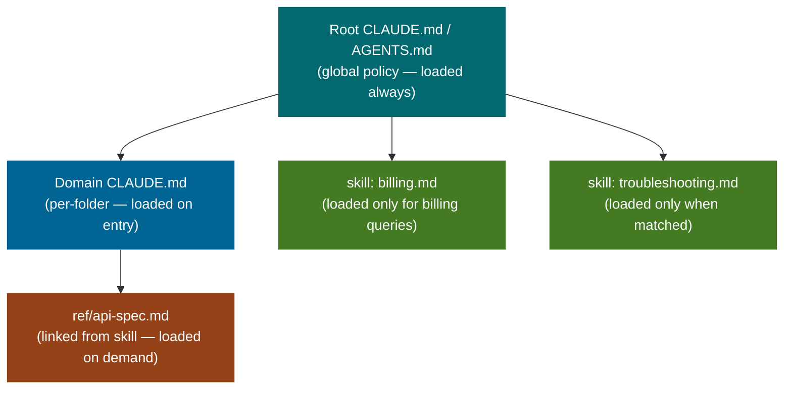

# What This Means for Steering File Design

*Vol 3 · Workspace Contracts*

---

## The Naming Landscape: STEERING.md and Its Aliases

Throughout this paper, "STEERING.md" refers to this concept generically: a persistent, plain-text file that lives in a repository and gives the AI agent standing behavioral context on every session, without invocation. Every major coding agent and IDE has its own version.

| Tool / Platform | Steering File Name | Location | Notable Characteristic |
|----------------|-------------------|----------|----------------------|
| **Claude Code (Anthropic)** | `CLAUDE.md` | Root + subdirectories | Hierarchical: global → project → folder; same file name at each level resolves parent-first |
| **OpenAI Codex** | `AGENTS.md` | Project root | Now stewarded by Linux Foundation AAIF; adopted by 60,000+ open-source repositories as of Dec 2025 |
| **Google Gemini CLI** | `GEMINI.md` | Root + subdirectories | Hierarchical loading; `/memory show` command lets you inspect the full concatenated context at any time |
| **GitHub Copilot (Microsoft)** | `.github/copilot-instructions.md` | `.github/` directory | Supports file-targeted `*.instructions.md` rules alongside the repo-wide file for context-scoped instructions |
| **Cursor IDE** | `.cursor/rules/*.mdc` | `.cursor/rules/` directory | Legacy: single `.cursorrules` at root. Modern: per-rule scoped `.mdc` files with agent/always-on/manual modes |
| **Windsurf (Codeium)** | `.windsurfrules` | Project root | Supports component-level rules (e.g. `.cicdrules.md`) alongside the root file for CI/CD and IAM-specific guidance |
| **Aider** | `CONVENTIONS.md` | Project root | Loaded via `--read` flag or `.aider.conf.yml` auto-load; also accepts `AGENTS.md` format for cross-tool compatibility |

The names differ; the mechanics differ slightly; the concept is identical.

A pattern this universal hasn't emerged by coincidence. Every team building an AI coding agent independently reached the same conclusion: the agent needs ambient project context that is always present, zero-cost to invoke, and version-controlled alongside the code. The steering file is the ecosystem's answer to *"how do we give agents project memory without building a database?"*

**Critically:** your steering file investment is not tool-specific. A well-written `STEERING.md` (in whatever name your toolchain uses) provides context to Claude Code, OpenAI Codex, Google Gemini CLI, GitHub Copilot, Cursor, Devin, Jules, and Factory — without per-tool configuration. Write once, inform all agents that arrive.

---

## The Convergence: AGENTS.md as a Cross-Vendor Standard

> **What AAIF standardization means in practice:** Before AAIF: each tool read its own file (`CLAUDE.md`, `GEMINI.md`, `.cursorrules`). After AAIF: `AGENTS.md` is the shared anchor file that all participating tools read, supplemented by tool-specific files for tool-specific behavior. A well-written `AGENTS.md` in your repository is read by Claude Code, Codex, Gemini CLI, Copilot, Cursor, and Devin — without any per-tool configuration. This is what a de facto standard looks like before tooling enforces it.

In December 2025, the Linux Foundation launched the **Agentic AI Foundation (AAIF)** with `AGENTS.md` as one of three founding project contributions — alongside Anthropic's Model Context Protocol and Block's Goose. [Ref 4](../references.md#vol3-ref-4)

Platinum AAIF members include Anthropic, OpenAI, Google, Microsoft, Amazon, Block, Bloomberg, and Cloudflare — 49 member organizations in total. `AGENTS.md` had already been adopted by 60,000+ open-source repositories and supported natively by Cursor, GitHub Copilot, Gemini CLI, Devin, Jules, Factory, Amp, and VS Code. The Linux Foundation adoption formalized what the ecosystem had already voted for with its behavior: a shared, vendor-neutral format for project-level AI context files.

---

## The Web Parallel: llms.txt

The same steering-file pattern appears at the web layer. Just as a STEERING.md gives AI agents context about a code repository, `llms.txt` gives AI systems context about a website. Proposed in 2025 and adopted by 600+ sites including Anthropic, Perplexity, Stripe, Cloudflare, and Zapier, it sits at the root of a domain and provides a structured, LLM-readable summary of what the site contains. [Ref 5](../references.md#vol3-ref-5)

The analogy is direct: a STEERING.md is to a code repository what `llms.txt` is to a website. Both are static, human-readable, machine-consumable files placed where agents arrive. Neither requires an API call or invocation. They are always there when the agent starts work. Think of it as `robots.txt` for AI — except instead of declaring what to exclude, it declares what to understand.

---

## What Belongs in a Steering File

Steering files are the right home for content that is **universal, durable, and needs to apply to every interaction without an invocation decision:**

- **Project-wide conventions and standing rules** — code style, output format standards, things the agent must never do
- **A compact pointer index** — "for workspace folder semantics, call describe-tool; for domain skills, see `.claude/skills/`" — that directs the agent to the right resources without embedding them inline
- **Per-workspace overrides** that differ from the shared defaults — customer-specific quirks, experimental settings, context that is genuinely unique to this workspace

The Vercel finding about the 8KB compressed index is the right mental model: the steering file's job is to *orient* the agent, not to document the workspace. A pointer to a skill is better than embedding the skill's content inline.

---

## What Does Not Belong in a Steering File

Moving domain knowledge into a steering file converts selective, on-demand context into always-on overhead. Every byte in STEERING.md is paid for on every query, whether or not that query touches the relevant domain.

**Don't put in a steering file:**

- **Domain-specific procedural knowledge** — put it in a skill, where it loads only when the query needs it
- **Policy content that applies to all workspaces** — put it in shared library code, not in each workspace's steering file
- **Auto-generated documentation of file history** — if you're in a Model B workspace, the tool surfaces it; if you're in a Model A workspace, auto-generate it via a tool like claude-mem, not manually
- **Full API documentation or technical references** — link to external files that load on demand

The Gloaguen finding bears repeating: heavy context files reduce task success. The discipline is keeping steering files minimal. A 5-line pointer file is more likely to improve performance than a 5,000-line documentation file.

---

## The Docs-as-Policy Trap

A common failure mode: design docs, READMEs, and runbooks are written for humans and then pointed at in the agent's context, effectively making them part of the agent's runtime contract. This is the same problem as heavy steering files, one level up.

**The correct pattern:** design docs are for humans. When a design doc produces a new policy, that policy is moved into the library code or a skill file as part of landing the change. The doc explains intent for humans; the runtime artifact is the source for agents.

Keeping these two sets disjoint is what preserves the Model B benefit — heavy context concerns apply to what the agent reads at runtime, not to what humans can read in long design documents.

---

## Steering File vs. Skill: The Decision

The clearest summary of what belongs where:

| Content Type | Steering File | Skill |
|-------------|---------------|-------|
| Universal rules that apply to every query | ✅ | ❌ Too heavy if always loaded |
| Domain knowledge for specific task types | ❌ Dead weight on unrelated queries | ✅ |
| Pointer to where skills/docs live | ✅ | ❌ |
| How to call the workspace surfacing tool | ✅ | Also viable as a skill |
| Customer-specific overrides | ✅ (per-workspace) | ❌ |
| Full API documentation | ❌ | ❌ Link to external file |
| Things the agent must never do | ✅ | ❌ Universal constraint |
| How to approach a specific problem type | ❌ | ✅ |

**When in doubt:** does this apply to *every* query? → Steering file (minimal). Does it apply to *some* queries? → Skill.

---

## Dos and Don'ts

**Do keep steering files minimal.** Universal rules, project identity, standing constraints, and a compact pointer index. If content doesn't apply to every single query, it belongs in a skill that loads on demand, not in the steering file. A 5-line pointer file reliably drives agent behavior; a 5,000-line documentation file costs performance without proportionate benefit.

**Don't embed domain knowledge in the steering file.** Moving domain knowledge into a steering file converts selective, on-demand context into always-on overhead. Every byte in CLAUDE.md / AGENTS.md is paid on every query. Domain-specific procedural knowledge belongs in skills. Policy content that applies to all workspaces belongs in shared library code. Auto-generated file history belongs in a tool that surfaces it, not in the steering file.

**Don't fall into the docs-as-policy trap.** Design docs, READMEs, and runbooks are for humans. When they produce new policy, that policy moves into code and skills. Keeping the two sets disjoint is what preserves the performance benefit — heavy context penalties apply to what the agent reads at runtime, not to what humans read in long documents.

---

*→ Next: [Discoverability, Decision Framework & Reference Architecture](05-reference-architecture.md)*
*← Previous: [The Empirical Evidence & Tradeoffs](03-evidence-and-tradeoffs.md)*
