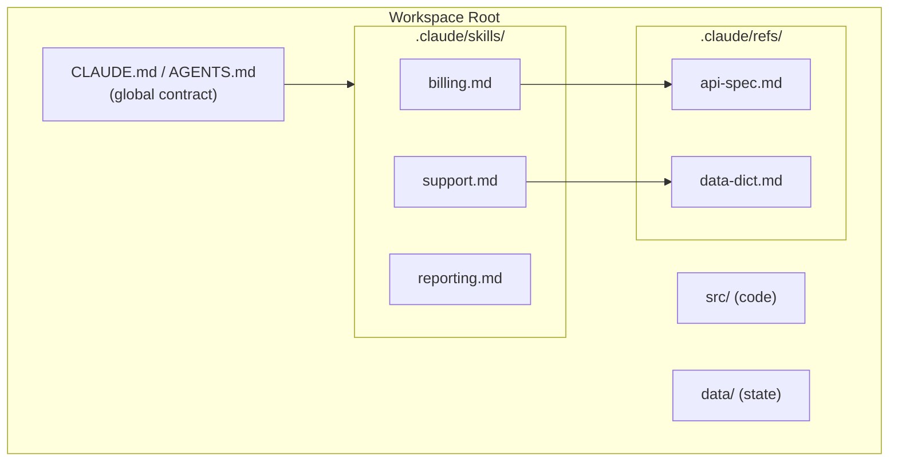

# Discoverability, Decision Framework & Reference Architecture

*Vol 3 · Workspace Contracts*

---

## Closing the Discoverability Gap for Model B

The load-bearing risk for Model B is **discoverability**: if a surfacing tool exists but the agent never calls it, the contract is not surfacing. Humans can be taught to run `describe-tool` once; LLM agents don't have that reflex. They will `cat` and `grep` whatever they find unless they are actively steered toward the surfacing tool.

The Vercel research provides the empirical shape of a solution: an anchor file that costs almost nothing (the compressed 8KB index) combined with skills that teach the invocation pattern. The anchor removes the agent's "should I look this up?" decision; the skill removes the "how do I look it up?" uncertainty. Together they close the gap that neither alone fully solves.

---

## The Minimal Pointer File

A static `$WORKITEM/README.md` or equivalent entry-point file, **written once at workspace creation and never edited as the contract evolves**, serves as the discoverability anchor. Its job is to tell both humans and agents: here is the surfacing tool, here is where overrides live.

**Content should be 5–20 lines maximum. Closer to 5 is better.**

Example for a Model B pipeline workspace:

```markdown

This workspace is managed by the customer data pipeline.

**To understand what a folder contains, what files are valid, or what a RUNID refers to:**
Run: `wslib describe <folder>` or `wslib describe <runid>`

**Per-workspace overrides:** see `overrides.yaml` in this folder.

Do not create files directly in /metrics/, /enriched/, or /logs/.
All writes must go through `wslib.write()`.
```

**What the pointer file should contain:**
- One line pointing to the surfacing tool
- One line pointing to the override path
- Optionally a one-line-per-directory semantics index

**What it should not contain:**
- Policy details, file patterns, retention rules — those belong in the library code, surfaced by the tool
- The workspace contract itself — if it changes, the pointer file becomes stale

**Update frequency:** ideally never after initial creation. If it changes, the contract has leaked into the pointer.

---

## The Skill Reinforcement Layer

A skill file in the appropriate skills directory teaches the agent the invocation pattern for the surfacing tool. The skill tells the agent: *when you need to know what a folder is for or what files are valid here, call describe-tool.*

This closes the "agent did not invoke" failure mode that Vercel's skill-default arm exposed (skill not triggered 56% of the time without explicit direction).

The recommendation given current evidence: **ship both the pointer file and the skill.** If validation shows the anchor alone is sufficient to drive agents to call the surfacing tool (analogous to Vercel's AGENTS.md docs-index winning at 100%), the skill file becomes redundant overhead and can be dropped in a follow-up after validation.

---

## Discoverability for Humans

Model B's discoverability cost for humans is real but bounded. New engineers who type `ls metrics/` don't see what the folder is for — they need to know a `describe-tool` exists.

The mitigation is the same as any modern toolchain: one onboarding reference that teaches the pattern, not a manpage in every directory. Once an engineer knows "run `describe-tool` to see what a folder is for," that knowledge applies everywhere in the organization, not just to one workspace. The upfront learning cost is lower than the ongoing maintenance cost of keeping per-folder READMEs current.

---

## The Decision Framework: Stable vs. Dynamic Workspaces

Use the following questions to determine the right model for a specific workspace.

| Question | If YES | If NO |
|----------|--------|-------|
| Does each folder in this workspace have a fixed role that does not change between runs? | Model A may fit well. Stamped content can remain accurate. | Model B is likely better. Stale context will accumulate. |
| Do files change on every run (new timestamped outputs, rotating metrics, run-specific data)? | **Model B.** Stamped "recent activity" will be outdated within a turn. | Model A may be appropriate if the workspace is otherwise stable. |
| Is the workspace contract (naming patterns, file types, producers) likely to evolve as tooling evolves? | **Model B.** Policy in code propagates automatically. Stamped files lag. | Model A is lower risk if the contract is stable. |
| Do multiple workspaces need to share the same policy with only minor per-workspace overrides? | **Model B.** Shared library defaults, per-workspace overrides only. | Model A is simpler if each workspace is truly independent. |
| Are there safety-critical contamination scenarios (wrong file type in wrong directory)? | **Model B.** Hard write-time guards, not soft README warnings. | Model A is acceptable if no hard enforcement is needed. |
| Is the primary consumer a human developer exploring a familiar codebase? | Model A is appropriate. Per-folder docs are useful and low-maintenance. | Consider Model B if the primary consumer is an agent in production. |

> **The dynamic workspace case:** `/customers/acme-corp/` with `/metrics/` (scoring-engine outputs), `/enriched/` (enrichment-tool `.parquet` files), `/logs/`, and `/raw/` (customer-uploaded CRM exports) → **Model B.** New timestamped files with fresh RUNIDs appear on every pipeline run. The contract evolves whenever the toolset evolves. Dozens of customer workspaces share identical policy. Contamination is safety-critical and needs a hard write-time guard. A per-folder STEERING.md describing the contents of `/metrics/` will be accurate on day one and wrong the day a new metric type ships — silently wrong, in every workspace.

> **The stable codebase case:** A software repository with `/src/`, `/tests/`, `/docs/`, `/config/` — each folder has a fixed, well-understood role. An engineer (human or AI) exploring it benefits from per-folder context explaining conventions, patterns, and what to expect. **Model A is appropriate.** The content is durable, the maintenance cost is low, and per-folder STEERING.md files from claude-mem.ai or manually written are a reasonable pattern.

---

## Reference Architecture



The following implements Model B for a multi-workspace, run-based system (the dynamic workspace case).

### Components

| Component | What It Is | What It Does |
|-----------|-----------|-------------|
| **Workspace Library** | Code: consuming library that knows the contract | Read/write files using declared `file_patterns`; enforce naming conventions; raise contamination as a hard error at write-time |
| **describe-tool** | CLI command surfacing the contract | Returns folder semantics, valid file types, producers, and current state for any workspace directory; fetches from live source, not a stamped file |
| **doctor-tool** | Audit-time checker | Detects orphaned files, stale state, contamination that slipped past write-time checks; reports rather than silently ignores |
| **skel.yaml / contract source** | Single source of truth for policy | Declares `file_patterns`, producers, retention rules, naming conventions; read by `wslib`, surfaced by `describe-tool`; never stamped into individual workspaces |
| **$WORKITEM/README.md** | Minimal 5-line pointer file | Tells human and agent: "call `describe-tool` for folder semantics, see `.claude/skills/` for workflows." Written once; never updated as contract evolves. |
| **Agent skills** | SKILL.md files for workflow guidance | Teach the agent how to call `describe-tool`, how to interpret results, how to handle edge cases. Loaded on-demand, not stamped everywhere. |
| **Per-workspace overrides** | Workspace-level config only for genuine deviations | Customer-specific quirks, experimental settings. Not for defaults; defaults live in `skel.yaml`. |

### The Agent Query Lifecycle in a Tool-Surfaced Workspace

```
Agent enters workspace
        │
        ▼
Reads the 5-line pointer README → [reads file]
        │
        ▼
Query arrives about file X in /metrics/
Agent calls: wslib describe metrics/ → [tool call]
        │
        ▼
Agent performs work
Calls: wslib.write() to persist output
wslib enforces file_patterns, rejects contamination → [deterministic code]
        │
        ▼
Unexpected file found / orphaned output detected?
doctor-tool detects and reports at next audit → [deterministic code]
        │
        ▼
New tool added to the pipeline?
skel.yaml updated once.
Every workspace and every agent call reflects the change automatically.
→ [single source of truth]
```

At no point does the agent read a per-folder STEERING.md that described the contract at initialization time. The contract is live, fetched on demand, and enforced in code.

---

## Dos and Don'ts

**Do use a minimal pointer file to close the agent discoverability gap.** A 5–20 line pointer file at the workspace entry point costs almost nothing in tokens, requires minimal maintenance (write once, update rarely), and the Vercel research validates that it reliably drives agents to use the surfacing tool. Resist the urge to grow it into documentation — as soon as it contains policy details it becomes a maintenance liability.

**Don't build Model B if you haven't built the tools.** Model B's guarantee is that the contract lives in code and surfaces through tools. If `describe-tool` doesn't exist, the contract isn't surfacing to anyone. The engineering investment is bounded — build the library and CLI once — but it is real. Committing to Model B without the tooling is committing to a worse version of Model A: no stamped files and no surfacing tools.

---

*→ Next: [Workspace Design: Working Across the Models](06-workspace-design-working-together.md)*
*← Previous: [What This Means for Steering File Design](04-steering-file-design.md)*
